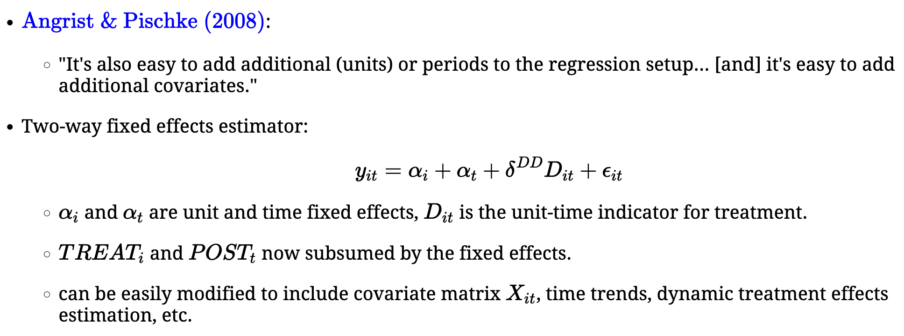

```{r setup, include=FALSE}
options(htmltools.dir.version = FALSE)
knitr::opts_chunk$set(
  fig.width=9, fig.height=3.5, fig.retina=3,
  out.width = "100%",
  cache = FALSE,
  echo = TRUE,
  message = FALSE, 
  warning = FALSE,
  hiline = TRUE
)
```

```{r xaringan-themer, include=FALSE, warning=FALSE}
knitr::opts_chunk$set(warning=FALSE, message=FALSE, comment=NA, prompt=FALSE, fig.height=6, fig.width=6.5, fig.retina = 3, dev = 'svg', dev.args = list(bg = "transparent"))
library(xaringanthemer); library(kableExtra); library(tidyverse); library(skimr)
# style_mono_accent(
style_duo_accent(
#style_solarized_light(
primary_color = "#371142", 
# header_color = "#ffffff",
          secondary_color = "#1c5253", 
          text_bold_color = "#FF00FF",
          link_color = "#F97B64",
          text_font_google   = google_font("EB Garamond"),
          code_font_google   = google_font("Fira Mono")
)
```

```{css, echo = FALSE, include=FALSE}
.remark-slide-content p, il, ol, li {
  font-size: 32px;
  padding: 8px 16px 8px 16px;
}
code.r{
  font-size: 18px;
}
pre {
  font-size: 24px;
}
.red { 
  color: red; 
}
.green { 
  color: green; 
}
.scrollable {
  height: 80%;
  overflow-y: auto;
} 
```

# Outline for Day 10:

1. Implementation of DPD/GMM
1. Conclusions of Panel GLM
1. TWFE
1. Causal Inference in Panel Data

---

## The Data for Implementation of GMM

```
Contains data from abdata.dta
  obs:         1,031                          Layard & Nickell, Unemployment
                                                in Britain, Economica 53, 1986
 ------------------------------------------------------------------------------
              storage  display     value
variable name   type   format      label      variable label
-------------------------------------------------------------------------------
ind             int    %8.0g                  industry
year            int    %8.0g
emp             float  %9.0g                  employment
wage            float  %9.0g                  real wage
cap             float  %9.0g                  gross capital stock
indoutpt        float  %9.0g                  industry output
n               float  %9.0g                  log(employment)
w               float  %9.0g                  log(real wage)
k               float  %9.0g                  log(gross capital stock)
ys              float  %9.0g                  log(industry output)
yr1980          float  %9.0g
yr1981          float  %9.0g
yr1982          float  %9.0g
yr1983          float  %9.0g
yr1984          float  %9.0g
id              float  %9.0g                  firm ID
-------------------------------------------------------------------------------
Sorted by:  id  year
```

---

## Implementation

- $\texttt{xtregar}$: , $\texttt{re}$ and $\texttt{fe}$ options

  - Fit a first order autoregressive structure to TSCS data.
  - Defaults to an iterative estimator but $\texttt{twostep}$ is available.
  - $\texttt{lbi}$ gives a test of the hypothesis that $\rho$ is zero. (not a default)

- $\texttt{xtabond}$
  - $\texttt{estat abond}$ gives a test for autocorrelation
  - $\texttt{estat sargan}$ gives the overidentifying restrictions test

- $\texttt{xtlsdvc y x, initial(ah or ab or bb) vcov(1000 bs iter)}$ will handle unbalanced \\ 
Bias-corrected least-squares dummy variable (LSDV) estimators for the standard autoregressive panel-data model using the bias approximations in Bruno (2005a) for unbalanced panels
- $\texttt{xtivreg}$
- $\texttt{xtdpd}$ fits Arellano-Bond and Arellano-Bover/Blundell-Bond
  - $\texttt{estat abond}$ gives a test for autocorrelation
  - $\texttt{estat sargan}$ gives the overidentifying restrictions test  (Rejection implies failure of assumptions)

---

## More on DPD

- David Roodman's excellent and well documented `xtabond2` extends the Stata command and incorporates orthogonal deviations transformation that assist in gapped panels.  I personally think it is the best software for this.
- Systems DPD is complicated but perhaps very useful.
- As an aside, I laughed pretty hard at a post on econ job rumours where someone claimed that no one actually understands these models!  [Not true, I am positive that Hansen does.....]


---

```{r, echo=FALSE}
library(foreign)
library(xtable)
# Trying this out with some NLS data (this matches stata's xtsum for the between)  You should find the data by google.
# nls.data <- read.dta("~/Downloads/nlswork.dta")
panel.summary <- function(mydata, idim) {
# Summarize the grand mean and unit means
# Example invocation: panel.summary(nls.data, nls.data$idcode)
mydata <- mydata # Need a macro for the dataset
idim <- as.vector(idim) # Pull the vector of the unit dimension
identifier <- table(idim) # Tabulate the unique identifiers
pan.btw <- matrix(data=NA, nrow=length(identifier), ncol=dim(mydata)[[2]]) # Basic matrix to fill in
pan.within <- matrix(data=NA, nrow=length(idim), ncol=dim(mydata)[[2]]) # A second storage for the within
for (i in 1:length(identifier)) {  # Loop over unique IDs to get Between things
  btw.vec <- NULL
  btw.mat <- NULL
  id.val <- as.numeric(names(identifier)[[i]]) # Create vector of values of ID
  for (j in 1:dim(mydata)[[2]]) { # Loop over columns in data.
  btw.vec <- mean(mydata[idim==id.val,j], na.rm=TRUE) # Unit means
  btw.mat <- c(btw.mat,btw.vec) # Append to existing
}
pan.btw[i,] <- btw.mat
}
# Now do the within.  This is the really slow and inefficient part.
pan.mean <- matrix(nrow=dim(mydata)[[1]], ncol=dim(mydata)[[2]])
for (i in 1:dim(mydata)[[1]]) { # loop over all rows in data
with.vec <- NULL
with.mat <- NULL
id.val <- idim[[i]]
 for (j in 1:dim(mydata)[[2]]) {
 with.vec <- mean(mydata[idim==id.val,j], na.rm=TRUE)
 with.mat <- c(with.mat,with.vec)
 }
pan.mean[i,] <- with.mat
}
# Generate within transformed data
res.mat.with <- mydata - pan.mean
# Summarize the within-centered
ret.sum.with <- apply(res.mat.with, 2, sd, na.rm=TRUE)
# Same thing to the between
ret.sum.btw <- apply(pan.btw, 2, sd, na.rm=TRUE)
names(ret.sum.btw) <- colnames(mydata)
mean.mat.btw <- pan.btw # Could collapse
colnames(mean.mat.btw) <- colnames(mydata)
colnames(res.mat.with) <- names(ret.sum.with) <- colnames(mydata)
# Create rows for summary statistics
# and store all of this in sum.out.both
sum.out.both <- matrix(data=NA,nrow=8, ncol=dim(mydata)[[2]])
colnames(sum.out.both) <- colnames(mydata)
grand.mean <- apply(mydata, 2, mean, na.rm=TRUE)
gmmat <- matrix(data=grand.mean, nrow=length(idim), ncol=dim(mydata)[[2]], byrow=TRUE)
mat2 <- (mydata-gmmat)^2
mat4 <- (pan.mean-gmmat)^2
mat6 <- res.mat.with^2
sum.out.both[1,] <- grand.mean
sum.out.both[2,] <- apply(mydata, 2, sd, na.rm=TRUE)
sum.out.both[3,] <- apply(mat2, 2, sum, na.rm=TRUE)
sum.out.both[4,] <- ret.sum.btw
sum.out.both[5,] <- apply(mat4, 2, sum, na.rm=TRUE)
sum.out.both[6,] <- ret.sum.with
sum.out.both[7,] <- apply(mat6, 2, sum, na.rm=TRUE)
sum.out.both[8,] <- sum.out.both[7,]/sum.out.both[3,]
rownames(sum.out.both) <- c("Grand mean","S.D.","TSS","Between S.D.","BSS", "Within S.D.","WSS","% Within")
# Return everything
pan.sum <- list(summary.btw=ret.sum.btw, mean.mat.btw=mean.mat.btw,summary.with=ret.sum.with, mean.mat.with=res.mat.with, sum.tab=round(sum.out.both, digits=4), grand.mean=grand.mean, mat2=mat2, mat4=mat4, mat6=mat6)
return(pan.sum)
}
library(plm)
data(EmplUK)
ps <- panel.summary(EmplUK, EmplUK$firm)
ps$sum.tab
```

---

```{r}
# To make it match the Stata data.
EmplUK$n <- log(EmplUK$emp)
EmplUK$w <- log(EmplUK$wage)
EmplUK$k <- log(EmplUK$capital)
EmplUK$ys <- log(EmplUK$output)
```

---

```{r, eval=FALSE}
# Can just use log syntax to solve it.
# Arellano and Bond (1991), table 4(a1) 
Table4.a1 <- pgmm(log(emp) ~ lag(log(emp), 1:2) + lag(log(wage), 0:1) + lag(log(capital), 0:2) + lag(log(output), 0:2) | lag(log(emp), 2:99), data = EmplUK, effect = "twoways", model = "onestep")
summary(Table4.a1)
```

---

```{r, echo=FALSE}
# Can just use log syntax to solve it.
# Arellano and Bond (1991), table 4(a1) 
Table4.a1 <- pgmm(log(emp) ~ lag(log(emp), 1:2) + lag(log(wage), 0:1) + lag(log(capital), 0:2) + lag(log(output), 0:2) | lag(log(emp), 2:99), data = EmplUK, effect = "twoways", model = "onestep")
summary(Table4.a1)
```


---

```{r, eval=FALSE}
## Arellano and Bond (1991), table 4b 
Table4.b <- pgmm(log(emp) ~ lag(log(emp), 1:2) + lag(log(wage), 0:1)
           + log(capital) + lag(log(output), 0:1) | lag(log(emp), 2:99),
            data = EmplUK, effect = "twoways", model = "twosteps")
# To make it match Stata
summary(Table4.b, robust=FALSE)
```

---

```{r, echo=FALSE}
## Arellano and Bond (1991), table 4b 
Table4.b <- pgmm(log(emp) ~ lag(log(emp), 1:2) + lag(log(wage), 0:1)
           + log(capital) + lag(log(output), 0:1) | lag(log(emp), 2:99),
            data = EmplUK, effect = "twoways", model = "twosteps")
# To make it match Stata
summary(Table4.b, robust=FALSE)
```


---

```{r, eval=FALSE}
# Or with Robust [Notice it is default]
summary(Table4.b)
```

---

```{r, echo=FALSE}
# Or with Robust [Notice it is default]
summary(Table4.b)
```

---

```{r, eval=FALSE}
## Blundell and Bond (1998) table 4
Table4.BB <- pgmm(log(emp) ~ lag(log(emp), 1)+ lag(log(wage), 0:1) +
           lag(log(capital), 0:1) | lag(log(emp), 2:99) +
           lag(log(wage), 2:99) + lag(log(capital), 2:99),        
           data = EmplUK, effect = "twoways", model = "onestep", 
           transformation = "ld") 
summary(Table4.BB, robust = TRUE)
```


---

```{r, echo=FALSE}
## Blundell and Bond (1998) table 4
Table4.BB <- pgmm(log(emp) ~ lag(log(emp), 1)+ lag(log(wage), 0:1) +
           lag(log(capital), 0:1) | lag(log(emp), 2:99) +
           lag(log(wage), 2:99) + lag(log(capital), 2:99),        
           data = EmplUK, effect = "twoways", model = "onestep", 
           transformation = "ld") 
summary(Table4.BB, robust = TRUE)
```
---

## References

The manual for R package $\texttt{plm}$ was published in the Journal of Statistical Software.  It is nice and extensive excepting the application of dpd models; only some are available.  There is also `panelvar` for panel VAR models that estimates even more `dpd` estimators.  Kit Baum has a very nice discussion of this in Stata in a set of course slides on the web at Boston College [search google for Baum Dynamic Panel Data Estimators].

---
## A Brief Point on FEVD

Plumper and Troeger have designed a procedure to solve one of the principle problems that arises in fixed effects regressions: it is either impossible or suboptimal to estimate the effects of time-invariant or nearly time-invariant regressors.  Their approach plays off of the generic consistency of the fixed effects estimator.  In general, they begin by estimating an LSDV model. $$y_{it} = \alpha_{i} + X_{it}\beta + \epsilon_{it}$$
They then proceed to model the unit effects as a function of (largely) time-invariant regressors that they denote as $Z$
$$\alpha_{i} = Z_{i}\gamma + \psi_{i}$$ In a third stage, they then construct the regression with an offset.  In effect, they take the offset and add it to the regression such as,
$$y_{it} = \psi_{i} + X_{it}\beta + Z_{i}\gamma + \nu_{it}$$ and adjust the variance/covariance matrix of the errors accordingly.


---

## Some Summary Remarks on Philosophy

- Poolers begin with the assumption that the data can be pooled and the composite/population averaged inference is general.
- Time series scholars begin with the belief that things should only be pooled with evidence in support of pooling.
- These are beliefs and proclivities more than insights from general rules.
- Substance and theory should drive model choices; the reverse is ridiculous given that we assume the right model.
- **I am surprised that GEE type models do not get far more play because of the typical nature of social science theorizing these days.**

---
class: inverse

# On Dynamics in Panel GLM

---

## $\texttt{xtgee}$ syntax

$\texttt{xtgee}$ operates off of the GLM family and link function ideas.  For example, probits and logits are family (binomial) with a probit or logit link. The key issue becomes specifying a working correlation matrix (within-groups/units) from among the options of exchangeable, independent, unstructured, fixed (must be user specified), ar (of order), stationary (of order), and nonstationary (of order).

---

## A Within-Between GEE

`panelr` estimates a Within-Between gee regression that extends the logic of GEE to limited outcomes.


---

## Binary Dynamics

There are four classes of discrete time series models that we might use for incorporating dynamics for binary observations varying across both time and space.  These get some treatment in the paper by Beck, et. al.

- Latent dependence (Dynamic Linear Models)
- State dependence (Markov Processes)
- Autoregressive disturbances
- Duration (survival models and isomorphisms)

---

## Latent Dependence

Carry on the setup from yesterday.

$$u_{i,t}^{*} = X\beta + \rho u^{*}_{i,t-1} + \epsilon_{it}$$

This is the analog of a lagged dependent variable regression fit in the latent space rather than the observed data.  Such models are probably easiest to fit using Bayesian data augmentation.

---

## Autoregressive Errors and Serial Correlation

$$u_{i,t}^{*}  =  X\beta + \epsilon_{it}$$
$$\epsilon_{i,t}  =  \rho \epsilon_{i,t-1} + \nu_{t}$$ 

where $\nu$ are i.i.d.  The model is odd in the sense that a shock to $X$ dies immediately but a shock to an omitted thing has dynamic impacts.  There are some suggested tests for serial correlation.  We will implement one of them that employs the generalized residual.  The idea is similar to what we have seen before.  Here, we have two outcome values and two possible generalized residuals.  We either have the density over the CDF or the negative of the density over one minus the CDF.  Then we want the covariance in time of the generalized residuals and need to calculate a variance given as
$$V(s) = \sum_{t=2}^{T} \frac{\phi_{t}^{2} \phi^{2}_{t-1}}{\Phi_{t}(1-\Phi_{t})\Phi_{t-1}(1-\Phi_{t-1})}$$  We could apply this individually or collectively to the whole set with $N$ summations added to the mix.  One can show that the covariance over the square root of $V(s)$ has an asymptotic normal distribution.

---

## BKT 1998

Beck, Katz, and Tucker (1998) point out that BTSCS are grouped duration data.  **Indeed, a cloglog discrete choice model is a Cox proportional hazards model.**  They are not similar, like each other, whatever.  They are isomorphic.  One can leverage this to do something about the temporal evolution of binary processes.   The details are in the lab on Box.  As an addition to this, Carter and Signorino have a compelling argument that instead of a completely saturated set of dummy variables for time since event, it is generically superior to use the Taylor series of time, time squared, and time cubed.

---

## Markov Processes

Markov processes extend to a general class of discrete events observed through time and across units.  While the reading discusses the binary case, extensions for ordered and multinomial events are straightforward.  I will show two examples.

$$\mathbf{P}  =  \left(\begin{array}{cccc}\pi_{11} & \pi_{12} &\ldots & \pi_{1J} \\
\pi_{21} & \ddots & \hdots  & \vdots \\ 
\vdots & \ddots & \hdots  & \vdots \\ 
\pi_{J1} & \pi_{J2} & \hdots & \pi_{JJ}\end{array}\right)$$


- Rows represent $s^{t}$: the state up to time $t$
- Columns represent $y^{t}$
- Rows sum to unity

The idea is that the current outcome depends on covariates and the prior state.  We can do a lot with that.


---
class: inverse

## Implementation

Is trivial.  It is a discrete choice model with interactions between the covariates [however structured in time] and the prior state.  By construction, it treats heterogeneity as uniformly a function of the prior state, at least in the simplest cast.  It also enables to distinct classes of tests.  Do the effects of a covariate depend on the prior state and what is the effect of some change in a covariate given an assumed state.  The range of counterfactuals is not small.


---
## Some General Comments on Panel GLM

- One has to be careful with these extensions of standard linear models. Ex. Random effects probit and fixed effects logit.
- The orthogonality of the random effects and the regressors is maintained.
- In most cases, the real trouble is incidental parameters.  That may not be as harsh as it initially seems.  William Greene has an interesting argument about this in his paper, *Estimating Econometric Models with Fixed Effects*.

---

## To My Examples

Questions that arise:

- What do the state dependent parameters represent?  Interpreting interaction terms.
- Do the effects of a given variable depend on the prior state?
- Is the effect given a prior state differentiable from zero?
- How do we calculate these things?


---
## Two Way Fixed Effects and Causal Inference


---
# Some DiD and TWFE

.pull-left[
DiD as the double difference [from Andrew C. Baker](https://andrewcbaker.netlify.app/did)
]
.pull-right[

]

---
## TWFE


---
# Equivalence



---
## The Problem


---

## Glynn and Blackwell

> Repeated measurements of the same countries, people, or groups over time are vital to many fields of political 
> science.  These measurements, sometimes called time-series cross-sectional (TSCS) data, allow researchers to estimate
> a broad set of causal quantities, including contemporaneous and lagged treatment effects. Unfortunately, popular 
> methods for TSCS data can only produce valid inferences for lagged effects under very strong assumptions. In this 
> paper, we use potential outcomes to define causal quantities of interest in this settings and clarify how standard 
> models like the autoregressive distributed lag model can produce biased estimates of these quantities due to 
> post-treatment conditioning. We then describe two estimation strategies that avoid these post-treatment 
> biases-inverse probability weighting and structural nested mean models-and show via simulations that they can 
> outperform standard approaches in small sample settings.

---

## Imai and Kim


> Many researchers use unit fixed effects regression models as their default methods for
> causal inference with longitudinal data. We show that the ability of these models to adjust
> for unobserved time-invariant confounders comes at the expense of dynamic causal relationships,
> which are allowed to exist under an alternative selection-on-observables approach.
> Using the nonparametric directed acyclic graph, we highlight the two key causal identification
> assumptions of fixed effects models: past treatments do not directly influence current
> outcome, and past outcomes do not affect current treatment. Furthermore, we introduce
> a new nonparametric matching framework that elucidates how various fixed effects models
> implicitly compare treated and control observations to draw causal inference. By establishing
> the equivalence between matching and weighted fixed effects estimators, this framework
> enables a diverse set of identification strategies to adjust for unobservables provided that
> the treatment and outcome variables do not influence each other over time. \end{quotation}

---

## Some Concluding Remarks

Plumper, et. al. 2005 point out that specification issues matter, alot.

- Absorbing cross-sectional variance by unit dummies.
- Absorbing time-series variance with lagged DV
- Lag structure matters
- Slope heterogeneity is a relevant consideration

Findings may not be at all robust.  

---

## My Own View
My own view of this, to borrow a phrase but use it a bit differently than the original authors, is to think of models as treatments with our data as the subject.  We make one set of assumptions and we treat our subject.  Change that around a bit and treat again.  Do it a third time and so on and so on.  In the end, we have sets of models related by subtle differences in assumptions about the process that generated the data and estimates obtained across models toward this end.  Our inferential process should be inherently Bayesian in the sense that we update the strength of conclusions on the basis of findings differing in predictable ways given these differing sets of assumptions. \newline \newline

.red[There is no single right model or magic bullet for diagnosing an unknown data generating process.]
