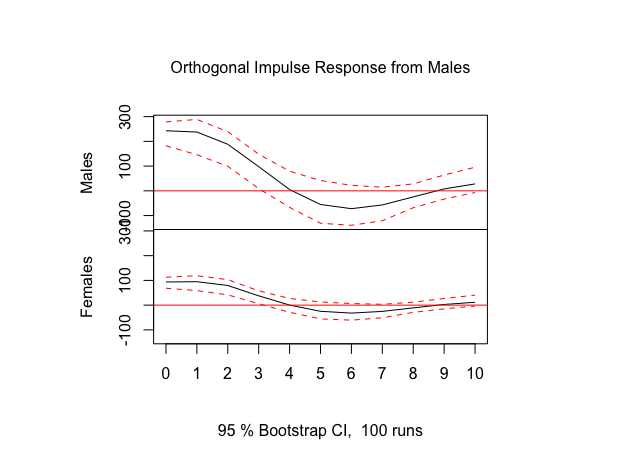
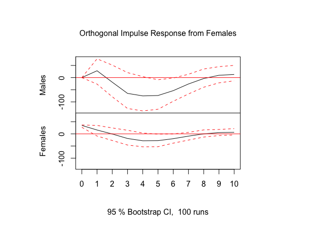

```{r setup, include=FALSE}
options(htmltools.dir.version = FALSE)
knitr::opts_chunk$set(
  fig.width=9, fig.height=3.5, fig.retina=3,
  out.width = "100%",
  cache = FALSE,
  echo = TRUE,
  message = FALSE, 
  warning = FALSE,
  hiline = TRUE
)
```

```{r xaringan-themer, include=FALSE, warning=FALSE}
knitr::opts_chunk$set(warning=FALSE, message=FALSE, comment=NA, prompt=FALSE, fig.height=6, fig.width=6.5, fig.retina = 3, dev = 'svg', dev.args = list(bg = "transparent"))
library(xaringanthemer); library(kableExtra); library(tidyverse); library(skimr)
# style_mono_accent(
style_duo_accent(
#style_solarized_light(
primary_color = "#371142", 
# header_color = "#ffffff",
          secondary_color = "#1c5253", 
          text_bold_color = "#FF00FF",
          link_color = "#F97B64",
          text_font_google   = google_font("EB Garamond"),
          code_font_google   = google_font("Fira Mono")
)
```

```{css, echo = FALSE, include=FALSE}
.remark-slide-content p, il, ol, li {
  font-size: 32px;
  padding: 8px 16px 8px 16px;
}
code.r{
  font-size: 18px;
}
pre {
  font-size: 24px;
}
.red { 
  color: red; 
}
.green { 
  color: green; 
}
```

# Outline for Day 3

1. Dynamic Models  
2. GLS vs. OLS and fixes

---

## Day 3: Dynamic Models

The ARIMA approach is fundamentally inductive.  The workflow involves the use of empirical values of ACFs and PACFs to engage in model selection.  Dynamic models engage theory/structure to impose more stringent assumptions for producing estimates.

---

## Time Series Linear Models/Dynamic Models

First, a result.  **Aitken Theorem**

In a now-classic paper, Aitken generalized the Gauss-Markov theorem to the class of Generalized Least Squares estimators.  It is important to note that these are GLS and not FGLS estimators.  What is the difference?  The two GLS estimators considered by Stimson are not strictly speaking GLS.

Definition $$\hat{\beta}_{GLS} = (\mathbf{X}^{\prime}\Omega^{-1}\mathbf{X})^{-1}\mathbf{X}^{\prime}\Omega^{-1}\mathbf{y}$$
> Properties 
>  
> (1) GLS is unbiased.  
> (2) Consistent.  
> (3) Asymptotically normal.  
> (4) MV(L)UE

---

## A Quick Example

The variance/covariance matrix of the errors for a first-order autoregressive process is useful to derive.  

1. The matrix is banded; observations separated by one point in time are correlated $\rho$.  Period two is $\rho^2$; the corners are $\rho^{T-1}$.  The diagonal is one.  

--

1. What I have actually described is the correlation; the relevant autocovariances are actually defined by $\frac{\sigma^{2}\rho^{s}}{1 - \rho^2}$ where $s$ denotes the time period separation.  

--

1. It is also straightforward to prove (tediously through induction) that this is invertible; it is square and the determinant is non-zero having assumed that $|\rho < 1|$.  
   -  The $2x2$ determinant is $\frac{1}{1-\rho^2}$.  
   -  The $3x3$ is $1*(1-\rho^2) - \rho(\rho - \rho^3) + \rho^2(\rho^2 - \rho^2)$.  The first term is positive and the second term is non-zero so long as $\rho \neq 0$.  But even if $\rho=0$, we would have an identity matrix which is invertible.

---

$$\Phi = \sigma^{2}\Psi = \sigma^{2}_{e}  \left(\begin{array}{ccccc}1 & \rho^{1} & \rho^{2} & \ldots & \rho^{T-1} \\ \rho^1 & 1 & \rho^1 & \ldots & \rho^{T-2} \\ \rho^{2} & \rho^1 & 1 & \ldots & \rho^{T-3} \\ \vdots & \vdots & \vdots & \ddots & \vdots \\ \rho^{T-1} & \rho^{T-2} & \rho^{T-3} & \ldots & 1 \end{array}\right)$$

given that $e_{t} = \rho e_{t-1} + \nu_{t}$.  A Toeplitz form....

If the variance is stationary, we can rewrite,
$$\sigma^{2}_{e} = \frac{\sigma^{2}_{\nu}}{1 - \rho^{2}}$$

A comment on characteristic roots....

---

## Cochrane-Orcutt

We have the two key elements to implement this except that we do not know $\rho$; we will have to estimate it and estimates have uncertainty.  But it is important to note this imposes exactly an AR(1).  If the process is incorrectly specified, then the optimal properties do not follow.  Indeed, the optimal properties also depend on an additional important feature.

---

## What does the feasible do?

We need to estimate things to replace unknown covariance structures
and coverage will depend on properties of the estimators of these
covariances.  

- Consistent estimators will work but there is
euphemistically `considerable variation` in the class of consistent
estimators.  

- Contrasting the Beck and Katz/White approach with the GLS
approach is a valid difference in philosophies.<sup>1</sup>  One takes advantage of OLS and Basus Theorem; one goes full Aitken.

.footnote[<sup>1</sup> We will return to this when we look at Hausman because this is the essential issue.]

---

## Incremental Models

$$y_{t} = a_{1} y_{t-1} + \epsilon_{t}$$

is the simplest dynamic model but it cannot be estimated consistently, in general terms, in the presence of serial correlation.  .red[Why?]

--
The key condition for unbiasedness is violated because $\mathbb{E}(y_{t-1}\epsilon_{t}) \neq 0$.  OLS will not generally work.

**A note on dynamic interpretation.**

---

## Incremental Models with Covariates

$$y_{t} = a_{1} y_{t-1} + \beta X_t + \epsilon_{t}$$

The problem is fitting and the key issue is white noise residuals post-estimation.  But we have to assume a structure and implement it.

---

## Distributed Lag Models

$$y_{t} = \alpha + \beta_{0} X_t + \beta_{1}x_{t-1} + \ldots + \epsilon_{t}$$

The impact of $x$ occurs over multiple periods.  It relies on theory, or perhaps analysis using information criteria/F [owing to quasi-nesting and missing data].  OLS is a fine solution to this problem but the search space of models is often large.

In response to this problem, we have structured distributed lag models; there are many such schemes.

- Koyck/Geometric decay:  

--
short run and long-run effects are parametrically identified
$$y_t = \alpha + \beta(1-\lambda)\sum_{j=0}^{\infty}\lambda^{j}X_{t-j} + \epsilon$$

--
- Almon (more arbitrary decay)
$$y_{it} = \sum_{t_{A}=0}^{T_{F}} \rho_{t_{A}}x_{t - t_{A}} + \epsilon_{t}$$ with coefficients that are ordinates of some general polynomial of degree $T_{F} >> q$.  The $\rho_{t_{A}} = \sum_{k=0}^{T_{F}} \gamma_{k}t^{k}$.


---

## Autoregressive Distributed Lag Models

$$y_{t} = \alpha + \gamma_{1}y_{t-1} + \beta_{0} X_t + \beta_{1}X_{t-1} + \beta_{2}X_{t-2} + \ldots + \epsilon_{t}$$

- OLS is often used if iid; $\epsilon_{t}$ is unrelated to $y_{t-1}$ is common if nonsensical.
- If not iid: GLS is needed.
- The authors argue that the lagged dependent variable often yields white noise for free.  As they also note, there is a deBoef and Keele paper showing the relationship between these models and a form of error correction models.  More on that tomorrow.
- There is substance to the timing of impacts.

---

## Structural vs. Non-structural

Data analysis can quite yield models comparisons among competing dynamic structures.  The key issue is that the analyst need divine the process; what is the relevant error process and what is the structure and timing of effects alongside the potential question of incremental adjustment.  We need good theory for that.

Given such theory, we can take an equations as analysis approach, measure the variables, and derive reduced forms, and then recover parameter estimates deploying simultaneous equations methods.  Very large such systems were a core part of early empirical macroeconomics.  The failures of such systems led to the proposal of alternatives.

Chris Sims suggested a more flexible approach: the VAR.  

---

## VAR: Vector AutoRegression

- Choose a relevant set of lag lengths and write each variable in the system as a function of lags of itself and other variables to the chosen lengths.<sup>1</sup> [For Stata](https://www.stata.com/manuals/tsvar.pdf) and [for R](https://otexts.com/fpp3/VAR.html)

.footnote[<sup>1</sup> A nice blog post with an extended example in R can be found on [towardsdatascience](https://towardsdatascience.com/a-deep-dive-on-vector-autoregression-in-r-58767ebb3f06).  Kit Baum has [a similar worked example in slides](http://fmwww.bc.edu/EC-C/S2016/8823/ECON8823.S2016.nn10.slides.pdf).]

--

- The key insight is that this VAR is the reduced form to some more complicated as yet unspecified structural form.  

--

- But if the goal is to specify how variables related to one another and to use data to discover Granger causality and responses to impulse injected in the system.

---

## A very simple example

```
library(forecast)
mdeaths
fdeaths
save(mdeaths, fdeaths, file = "./img/LungDeaths.RData")
```

```{r, eval=FALSE}
library(hrbrthemes)
load(url("https://github.com/robertwwalker/Essex-Data/raw/main/LungDeaths.RData"))
Males <- mdeaths; Females <- fdeaths
Lung.Deaths <- cbind(Males, Females) %>% as_tsibble()
Lung.Deaths %>% autoplot() + theme_ipsum_rc()
```

---

```{r, echo=FALSE, fig.width=6, fig.height=3.5}
library(hrbrthemes); library(fpp3)
load(url("https://github.com/robertwwalker/Essex-Data/raw/main/LungDeaths.RData"))
Males <- mdeaths; Females <- fdeaths
Lung.Deaths <- cbind(Males, Females) %>% as_tsibble()
Lung.Deaths %>% autoplot() + theme_ipsum_rc() + labs(y="Lung Deaths", x="Month [1M]", title="Lung Deaths among Males and Females") + guides(color="none")
```

---

.left-column[
```{r, eval=FALSE}
lung_deaths <- cbind(mdeaths, fdeaths) %>%
  as_tsibble(pivot_longer = FALSE)
fit <- lung_deaths %>%
  model(VAR(vars(mdeaths, fdeaths) ~ AR(3)))
report(fit)
```
]
.right-column[
```{r, echo=FALSE}
lung_deaths <- cbind(mdeaths, fdeaths) %>%
  as_tsibble(pivot_longer = FALSE)
fit <- lung_deaths %>%
  model(VAR(vars(mdeaths, fdeaths) ~ AR(3)))
report(fit)
```
]

---

.left-column[
```{r, eval=FALSE}
fit2 <- lung_deaths %>%
  model(VAR(vars(mdeaths, fdeaths) ~ AR(2)))
report(fit2)
```
]
.right-column[
```{r, echo=FALSE}
fit2 <- lung_deaths %>%
  model(VAR(vars(mdeaths, fdeaths) ~ AR(2)))
report(fit2)
```
]


---

```{r, fig.width=6, fig.height=3}
fit %>%
  fabletools::forecast(h=12) %>%
  autoplot(lung_deaths)
```


---
class: inverse

### Female

.left-column[
```{r, eval=FALSE}
lung_deaths %>%
model(VAR(vars(mdeaths, fdeaths) ~ AR(3))) %>%
  residuals() %>% 
  pivot_longer(., cols = c(mdeaths,fdeaths)) %>% 
  filter(name=="fdeaths") %>% 
  as_tsibble(index=index) %>% 
  gg_tsdisplay(plot_type = "partial") + labs(title="Female residuals
```
]
.right-column[
```{r, echo=FALSE, fig.width=6, fig.height=3.5}
lung_deaths %>%
model(VAR(vars(mdeaths, fdeaths) ~ AR(3))) %>%
  residuals() %>% 
  pivot_longer(., cols = c(mdeaths,fdeaths)) %>% 
  filter(name=="fdeaths") %>% 
  as_tsibble(index=index) %>% 
  gg_tsdisplay(plot_type = "partial") + labs(title="Female residuals")
```
]

---
class: inverse

### Male

.left-column[
```{r, eval=FALSE}
lung_deaths %>%
model(VAR(vars(mdeaths, fdeaths) ~ AR(3))) %>%
  residuals() %>% 
  pivot_longer(., cols = c(mdeaths,fdeaths)) %>% 
  filter(name=="mdeaths") %>% 
  as_tsibble(index=index) %>% 
  gg_tsdisplay(plot_type = "partial") + labs(title="Male residuals
```
]
.right-column[
```{r, echo=FALSE, fig.width=6, fig.height=3.5}
lung_deaths %>%
model(VAR(vars(mdeaths, fdeaths) ~ AR(3))) %>%
  residuals() %>% 
  pivot_longer(., cols = c(mdeaths,fdeaths)) %>% 
  filter(name=="mdeaths") %>% 
  as_tsibble(index=index) %>% 
  gg_tsdisplay(plot_type = "partial") + labs(title="Male residuals")
```
]

---

## Easy Impulse Response

**What happens if I shock one of the series; how does it work through the system?**  

The idea behind an impulse-response is core to counterfactual analysis with time series.  What does our future world look like and what predictions arise from it and the model we have deployed?

--

Whether VARs or dynamic linear models or ADL models, these are key to interpreting a model **in the real world**.

---

### Males

.left-column[
```{r, eval=FALSE}
VARMF <- cbind(Males,Females)
mod1 <- vars::VAR(VARMF, p=3, type="const")
plot(vars::irf(mod1, boot=TRUE, impulse="Males"))
```
]
.right-column[

]

---

### Females

.left-column[
```{r, fig.height=6, fig.width=3.5, eval=FALSE}
plot(vars::irf(mod1, boot=TRUE, impulse="Females"))
```
]
.right-column[

]