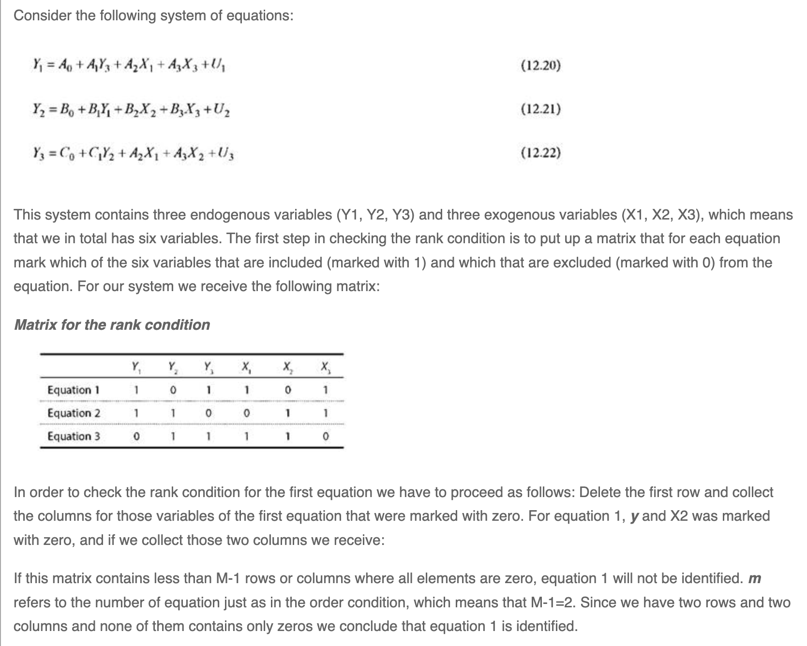
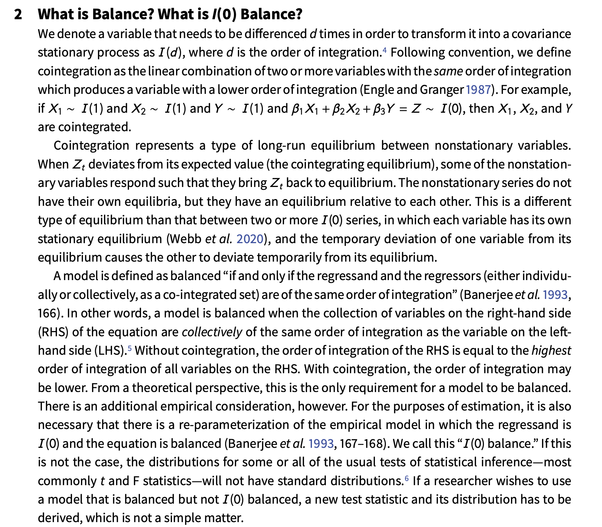
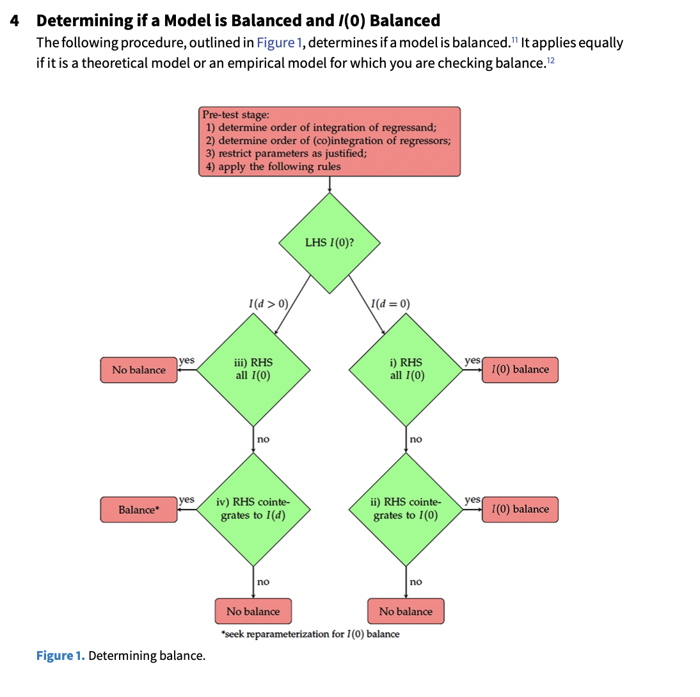

```{r setup, include=FALSE}
options(htmltools.dir.version = FALSE)
knitr::opts_chunk$set(
  fig.width=9, fig.height=3.5, fig.retina=3,
  out.width = "100%",
  cache = FALSE,
  echo = TRUE,
  message = FALSE, 
  warning = FALSE,
  hiline = TRUE
)
```

```{r xaringan-themer, include=FALSE, warning=FALSE}
knitr::opts_chunk$set(warning=FALSE, message=FALSE, comment=NA, prompt=FALSE, fig.height=6, fig.width=6.5, fig.retina = 3, dev = 'svg', dev.args = list(bg = "transparent"))
library(xaringanthemer); library(kableExtra); library(tidyverse); library(skimr)
# style_mono_accent(
style_duo_accent(
#style_solarized_light(
primary_color = "#371142", 
# header_color = "#ffffff",
          secondary_color = "#1c5253", 
          text_bold_color = "#FF00FF",
          link_color = "#F97B64",
          text_font_google   = google_font("EB Garamond"),
          code_font_google   = google_font("Fira Mono")
)
```

```{css, echo = FALSE, include=FALSE}
.remark-slide-content p, il, ol, li {
  font-size: 32px;
  padding: 8px 16px 8px 16px;
}
code.r{
  font-size: 18px;
}
pre {
  font-size: 24px;
}
.red { 
  color: red; 
}
.green { 
  color: green; 
}
```

# Outline for Day 5

1. Background on IV  
2. Structural Systems of Equations
3. ARCH/GARCH
4. Other Advances in Time Series
5. Equation Balance

---

## Day 5: Time Series Grab Bag


---

## Instrumental Variables

A simple system.

$$y_{1}^{*} = X_{1} \beta_{1} + \alpha_{1} y_{2}^{*} + \epsilon_{1}$$
$$y_{2}^{*} = X_{2} \beta_{2} + \alpha_{2} y_{1}^{*} + \epsilon_{2}$$

- $X_{1}$ and $X_{2}$ are sets of exogenous variables that satisfy rank and order conditions
- $\epsilon_{1}$ and $\epsilon_{2}$ are bivariate normal random errors with
correlation $\rho$, and $\beta$ and $\alpha$ are parameters to be estimated.

What are these rank and order conditions?

---
## Rank

In a system of G equations any particular equation is identified **if and only if** it is possible to construct at least one non-zero determinant of the order
(G-1) from the coefficients excluded from that particular equation but contained in other equations of the model.

A sufficient condition for the identification of a relationship is that the rank of the matrix of parameters of all the excluded variables (endogenous and pre-determined) from that equation be equal to (G-1).

This is an application of the rank of a matrix -- the number of linearly independent columns.

---

.pull-left[

]
.pull-right[
In order to check the rank condition for the first equation we have to proceed as follows: Delete the first row and collect the columns for those variables of the first equation that were marked with zero. For equation 1, y and X2 was marked with zero, and if we collect those two columns we receive:

If this matrix contains less than M-1 rows or columns where all elements are zero, equation 1 will not be identified. m refers to the number of equation just as in the order condition, which means that M-1=2. Since we have two rows and two columns and none of them contains only zeros we conclude that equation 1 is identified.
[Citation:](https://ebrary.net/1028/economics/identification)
]

---

## Order

1. For an equation to be identified the total number of variables excluded from it must be equal to or greater than the number of endogenous variables in the model less one.  OR  
1. For an equation to be identified the total number of variables excluded from it but included in other equations must be at least as great as the number of equations in the system less one.

Let:
G = total number of equations (total number of endogenous variables.
K= total number of variables in the model (endogenous and pre-determined).
M = number of variables, endogenous and pre-determined, in a particular equation.

$$K-M \geq G-1$$


The order condition is a necessary condition for identification but it is not sufficient.

---
## Application to Structural Systems

To acquire estimates of the system, each equation must be at least identified.  To confirm this, one must at least utilize the rank condition from above.  Why is identification important?  It means that there is at least some unique information applied to each endogenous element.

---
## GARCH Models

We are most often concerned with non-stationarity in the mean.

There is an entire suite of models, particularly used in finance applications with high frequency data focused on variance.  These are known as AutoRegressive Conditional Heteroscedasticity Models or ARCH models.

A simple univariate model:

$$y_t = a_0 + a_1 y_{t-1} + e_t$$

where 

$$e_t = v_t h_{t}^{\frac{1}{2}}$$
with $v_t$ as white noise.  Thus, the conditional variance of the series is given by

$$h_t = \alpha_{0} + \alpha_{1} e^{2}_{t-1}$$
---
## Finding ARCH

1. Estimate some best model for your time series.
1. Isolate residuals and square them -- variance.
1. Estimate a regression of current squared errors on $n$ lags of the prior [squared] error.
1. The test statistic is T (basically N) times $R^2$ is distributed $\chi^2$ with $n$ degrees of freedom under the null hypothesis of no ARCH effects.

---
## Other Advances

Fractional integration methods.
Structural breaks: see Jong Hee Park's work.


---

## Equation Balance

.pull-left[
Their definition
]
.pull-right[

]

---

## How to Use It

.pull-left[
Can apply to both the theoretical and the empirical model.
]
.pull-right[

]

---
## A Summary Paper to Think About

Andy Phillips has a recent paper on inference in dynamic settings.  It is in the box for day 5.  The paper is:

**How to avoid incorrect inferences (while gaining correct ones) in dynamic models**