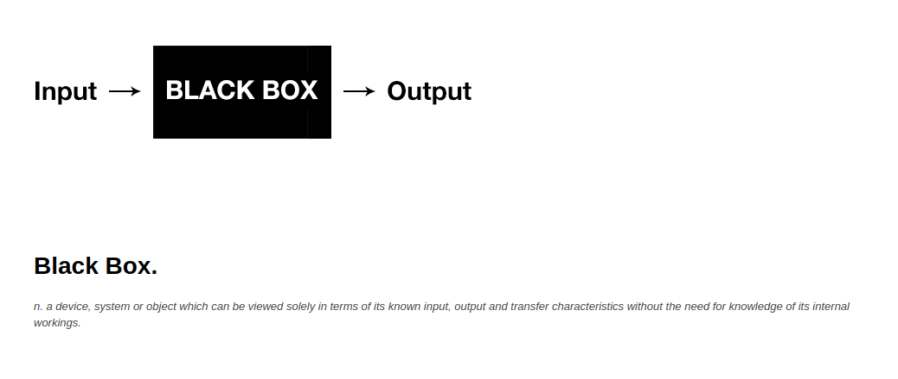
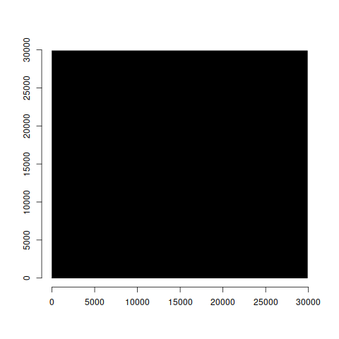

background-image: url("img/SquaresBG.jpg")
class: center, middle

--

```{r setup, include=FALSE}
options(htmltools.dir.version = FALSE)
knitr::opts_chunk$set(warning=FALSE, message=FALSE, comment=NA, prompt=FALSE, fig.height=6, fig.width=6.5, fig.retina = 3, dev = 'svg', dev.args = list(bg = "transparent"))
library(xaringanthemer); library(kableExtra); library(tidyverse); library(skimr)
# style_mono_accent(
style_duo_accent(
#style_solarized_light(
primary_color = "#371142", 
# header_color = "#ffffff",
          secondary_color = "#1c5253", 
#          text_bold_color = "#FF00FF",
          link_color = "#F97B64",
          text_font_google   = google_font("EB Garamond"),
          code_font_google   = google_font("Fira Mono")
)
options(scipen=8)
black.box.maker <- function(mod1) {
            d1 <- dim(mod1$model)[[1]]
            sumsq1 <- var(mod1$model[,1], na.rm=TRUE)*(d1-1)
            rt1 <- sqrt(sumsq1)
            sumsq2 <- var(mod1$fitted.values, na.rm=TRUE)*(d1-1)
            rsquare <- round(sumsq2/sumsq1, digits=4)
            rt2 <- sqrt(sumsq2)
            plot(x=NA, y=NA, xlim=c(0,rt1), ylim=c(0,rt1), main=paste("R-squared:",rsquare), xlab="", ylab="", bty="n", cex=0.5)
            polygon(x=c(0,0,rt1,rt1), y=c(0,rt1,rt1,0), col="black")
            polygon(x=c(0,0,rt2,rt2), y=c(0,rt2,rt2,0), col="green")
}

black.box.maker.NT <- function(mod1) {
            d1 <- dim(mod1$model)[[1]]
            sumsq1 <- var(mod1$model[,1], na.rm=TRUE)*(d1-1)
            rt1 <- sqrt(sumsq1)
            sumsq2 <- var(mod1$fitted.values, na.rm=TRUE)*(d1-1)
            rsquare <- round(sumsq2/sumsq1, digits=4)
            rt2 <- sqrt(sumsq2)
            plot(x=NA, y=NA, xlim=c(0,rt1), ylim=c(0,rt1), main="", xlab="", ylab="", bty="n", cex=0.5)
            polygon(x=c(0,0,rt1,rt1), y=c(0,rt1,rt1,0), col="black")
            polygon(x=c(0,0,rt2,rt2), y=c(0,rt2,rt2,0), col="green")
}
library(xaringanExtra)
```


```{css, echo = FALSE, include=FALSE}
.remark-slide-content p, il, ol, li {
  font-size: 32px;
  padding: 8px 16px 8px 16px;
}
code.r{
  font-size: 18px;
}
pre {
  font-size: 24px;
}
.red { 
  color: red; 
}
.green { 
  color: green; 
}
```



---
class: inverse

## Models Use Inference to ...

--

## Unpack Black Boxes

--

## We will literally do it with boxes/squares


---
# Data and a Library

```{r, warning=FALSE, message=FALSE}
library(tidyverse); library(patchwork); library(skimr)
load(url("https://github.com/robertwwalker/DADMStuff/raw/master/RegressionExamples.RData"))
source('https://github.com/robertwwalker/DADMStuff/raw/master/ResidPlotter.R')
source('https://github.com/robertwwalker/DADMStuff/raw/master/PlotlyReg.R')
```

---
# Pivots Gather/Spread and tidy data

Radiant can be picky about data structures.  `ggplot` is built around the idea of tidy data from Week 2.  How do we make data tidy?

At the command line, it is `pivot_wider` and `pivot_longer` while radiant uses the [at some point to be obsolete `spread`/`gather`]

Let's take a look with these data.

---
# A Bit on Covariance and Correlation

Covariance is defined as:
$$\sum_{i} (x_{i} - \overline{x})(y_{i} - \overline{y})$$

Where $\overline{x}$ and $\overline{y}$ are the sample means of x and y.  The items in parentheses are deviations from the mean; covariance is the product of those deviations from the mean.  The metric of covariance is the product of the metric of $x$ and $y$; often something for which no baseline exists.  For this reason, we use a normalized form of covariance known as correlation, often just $\rho$.

$$\rho_{xy} = \sum_{i} \frac{(x_{i} - \overline{x})(y_{i} - \overline{y})}{s_{x}s_{y}}$$

Correlation is a **normed** measure; it varies between -1 and 1.

---
class: inverse

## An Oregon Gender Gap

--

.pull-left[
A random sample of salaries in the 1990s for new hires from Oregon DAS.  I know *nothing* about them.  It is worth noting that these data represent a protected class by Oregon statute.  We have a state file or we can load the data from github.  They are random samples -- not correlated -- but even if they might be correlated, I would need to know who is *paired* with whom.  I must treat them as *independent*.

```{r Chunk1E, eval=FALSE}
OregonSalaries %>% 
  select(-Obs) %>% 
  mutate(Row = rep(c(1:16),2)) %>% 
  pivot_wider(names_from = Gender, values_from = Salary) %>% select(-Row)
```
]

.pull-right[
```{r Chunk1A, echo=FALSE}
OregonSalaries %>% 
  select(-Obs) %>% 
  mutate(Row = rep(c(1:16),2)) %>% 
  pivot_wider(names_from = Gender, values_from = Salary) %>% select(-Row)
```
]


---
## Visualising Independent Samples

```{r}
ggplot(OregonSalaries) + aes(x=Gender, y=Salary) + geom_boxplot() + theme_xaringan()
```

---
## Visualising Independent Samples

```{r}
ggplot(OregonSalaries) + aes(x=Gender, y=Salary, fill=Gender) + geom_violin() + theme_xaringan()
```


---
## About Those Squares: Deviations


The mean of all salaries is `r round(mean(OregonSalaries$Salary), digits=3)`.  Represented in equation form, we have:

$$Salary_{i} = \alpha + \epsilon_{i}$$

The $i^{th}$ person's salary is some average salary $\alpha$ [or perhaps $\mu$ to maintain conceptual continuity] (shown as a solid blue line) plus some idiosyncratic remainder or residual salary for individual $i$ denoted by $\epsilon_{i}$ (shown as a blue arrow).  Everything here is measured in dollars.

$$Salary_{i}  = `r round(mean(OregonSalaries$Salary), digits=3)` + \epsilon_{i}$$

```{r Plot11a, eval=FALSE, echo=FALSE, message=FALSE, warning=FALSE}
ORSalScale <- scale(OregonSalaries$Salary, scale=FALSE)
png("img/Dev1.png")
plot(y=OregonSalaries$Salary, x=c(1:32), ylab="Salary", col=as.factor(OregonSalaries$Gender), xlab="", pch=c(rep("F",16),rep("M",16)))
abline(h=mean(OregonSalaries$Salary), col="blue")
arrows(x0=c(1:32), x1=c(1:32), y1=OregonSalaries$Salary,y0=mean(OregonSalaries$Salary), col="blue", code=3, length=0.05)
text(x=seq(1,16), y=rep(c(47000,48000,49000,50000),4), labels = paste(ceiling(ORSalScale[c(1:16)])), cex=0.7, col="blue")
text(x=c(17:32), y=rep(c(30000,31000,32000,33000),4), labels = paste(ceiling(ORSalScale[c(17:32)])), cex=0.7, col="blue")
dev.off()
png("img/Dev2.png")
plot(y=OregonSalaries$Salary, x=c(1:32), ylab="Salary", col=as.factor(OregonSalaries$Gender), xlab="", pch=c(rep("F",16),rep("M",16)))
abline(h=mean(OregonSalaries$Salary), col="blue")
arrows(x0=c(1:32), x1=c(1:32), y1=OregonSalaries$Salary,y0=mean(OregonSalaries$Salary), col="blue", code=3, length=0.05)
text(x=seq(1,16), y=rep(c(47000,48000,49000,50000),4), labels = paste(ceiling(ORSalScale[c(1:16)]^2)), cex=0.7, col="blue")
text(x=c(17:32), y=rep(c(30000,31000,32000,33000),4), labels = paste(ceiling(ORSalScale[c(17:32)]^2)), cex=0.7, col="blue")
dev.off()
mod1 <- lm(Salary~1, data=OregonSalaries)
# summary(mod1)
png("img/Dev3.png")
black.box.maker.NT(mod1)
dev.off()
```


---
class: left
background-image: url("img/Dev1.png")
background-position: right

--

```{r Tabaaa, echo=FALSE}
OregonSalaries %>% 
  select(-Obs) %>% 
  mutate(Row = rep(c(1:16),2), Salary = scale(Salary, scale=FALSE)) %>% 
  pivot_wider(names_from = Gender, values_from = Salary) %>% select(-Row)
```

---

By definition, those vertical distances would/will sum to zero.  **This sum to zero constraint is what consumes a degree of freedom; it is why the standard deviation has N-1 degrees of freedom.**  The distance from the point to the line is also shown in blue; that is the observed residual salary.  It shows how far that individual's salary is from the overall average.

---
class: left
background-image: url("img/Dev2.png")
background-position: right

# A Big Black Box
--

```{r Tabaaa2, echo=FALSE}
OregonSalaries %>% 
  select(-Obs) %>% 
  mutate(Row = rep(c(1:16),2), Salary = scale(Salary, scale=FALSE)^2) %>% 
  pivot_wider(names_from = Gender, values_from = Salary) %>% select(-Row)
OregonSalaries %>% 
  select(-Obs) %>% 
  mutate(Row = rep(c(1:16),2), Salary.Deviation.Squared = scale(Salary, scale=FALSE)^2) %>% summarise(sum(Salary.Deviation.Squared))
```

---
## The Black Box of Salaries

The total area of the `black box` in the original metric (squared dollars) is: `r ceiling(sum(lm(Salary~1, data=OregonSalaries)$residuals^2))`.  The length of each side is the square root of that area, e.g. `r round(sqrt(sum(lm(Salary~1, data=OregonSalaries)$residuals^2)), 2)` in dollars.



---
class: inverse
background-image: url("img/Dev3.png")
background-position: bottom

This square, when averaged by degrees of freedom and called *mean square*, has a known distribution, $\chi^2$ *if we assume that the deviations, call them errors, are normal.*

---
# The $\chi^2$ distribution

The $\chi^2$ [chi-squared] distribution can be derived as the sum of $k$ squared $Z$ or standard normal variables.  Because they are squares, they are always positive.  The $k$ is called *degrees of freedom*.  Differences in $\chi^2$ also have a $\chi^2$ distribution with degrees of freedom equal to the difference in degrees of freedom.

As a technical matter (for x > 0): $$f(x) = \frac{1}{2^{\frac{k}{2}}\Gamma(k/2)} x^{\frac{k}{2-1}}e^{\frac{-x}{2}}$$

---
# Some language and $F$

*Sum of squares*: $$\sum_{i=1}^{N} e_{i}^{2}$$
*Mean square*: divide the sum of squares by $k$ degrees of freedom.  NB: Take the square root and you get the standard deviation. $$\frac{1}{k}\sum_{i=1}^{N} e_{i}^{2}$$

Fisher's $F$ ratio or the $F$ describes the ratio of two $\chi^2$ variables (mean square) with numerator and denominator degrees of freedom.  It is the ratio of [degrees of freedom] averaged squared errors.  As the ratio becomes large, we obtain greater evidence that the two are not the same.  Let's try that here.

---
# The Core Conditional

But all of this stems from the presumption that $e_{i}$ is normal; that is a claim that cannot really be proven or disproven.  *It is a core assumption that we should try to verify/falsify.*

Because the $e_{i}$ being normal means implies that their squares are $\chi^2$<sup>a</sup> and further that the ratio of their mean-squares are $F$.

As an aside, the technical definition of $t$<sup>b</sup>   is a normal divided by the square root of a $\chi^2$ so $t$ and $F$ must be equivalent with one degree of freedom in the numerator.

.footnote[

<sup>a</sup> This is why the various results in prop.test are reported as X-squared.

<sup>b</sup> I mentioned this fact previously when introducing t (defined by degrees of freedom and with metric standard error.)

]

---

# Verification of the Normal

1. Plots [shape]
2. the quantile-quantile plot
3. Statistical tests

---
# plots

```{r}
plot(density(lm(OregonSalaries$Salary~1)$residuals), main="Residual Salary")
```

---
### the quantile-quantile plot of a normal

.pull-left[
The mean of residual salary is zero.  The standard deviation is the root-mean-square.  Compare observed residual salary [as z] to the hypothetical normal.

```{r, eval=FALSE}
data.frame(x=scale(lm(OregonSalaries$Salary~1)$residuals)) %>% arrange(x) %>%  mutate(y=qnorm(seq(1, length(OregonSalaries$Salary))/33)) %>% ggplot() + aes(x=x, y=y) + geom_point()
```
]

.pull-right[
```{r, echo=FALSE}
data.frame(x=scale(lm(OregonSalaries$Salary~1)$residuals)) %>% ggplot() + aes(sample=x) + stat_qq() + stat_qq_line()
```
]

---
## tests

We can examine the claim that residual salary is plausibly normal by examining the slope of the sample and theoretical quantiles: the slope of the q-q plot.  This is exactly what the following does under the null hypothesis of a normal.

```{r}
shapiro.test(lm(Salary~1, data=OregonSalaries)$residuals)
```

---
## Linear Models

Will expand on the previous by unpacking the box, reducing residual squares via the inclusion of *features, explanatory variables, explanatory factors, exogenous inputs, predictor variables*.  In this case, let us posit that salary is a function of gender.  As an equation, that yields:

$$Salary_{i} = \alpha + \beta_{1}*Gender_{i} + \epsilon_{i}$$
We want to measure that $\beta$; in this case, the difference between Male and Female.  By default, R will include Female as the constant.

What does the regression imply?  That salary for each individual $i$ is a function of a constant and gender.  Given the way that R works, $\alpha$ will represent the average for females and $\beta$ will represent the difference between male and female average salaries.  The $\epsilon$ will capture the difference between the individual's salary and the average of their group (the mean of males or females).


---
## A New Residual Sum of Squares

.pull-left[
The picture will now have a red line and a black line and the residual/leftover/unexplained salary is now the difference between the point and the respective vertical line (red arrows or black arrows).  What is the relationship between the datum and the group mean?  The answer is shown in black/red.  
]
.pull-right[

```{r BasePlot, echo=FALSE}
ORSalScale <- scale(OregonSalaries$Salary, scale=FALSE)
resids <- residuals(lm(Salary~Gender, data=OregonSalaries))
plot(y=OregonSalaries$Salary, x=c(1:32), ylab="Salary", col=as.factor(OregonSalaries$Gender), xlab="", pch=c(rep("F",16),rep("M",16)))
abline(h=mean(OregonSalaries$Salary), col="blue")
abline(h=mean(subset(OregonSalaries, Gender=="Female")$Salary, na.rm=T), col="black")
abline(h=mean(subset(OregonSalaries, Gender=="Male")$Salary, na.rm=T), col="red")
arrows(x0=c(1:32), x1=c(1:32), y1=OregonSalaries$Salary,y0=mean(OregonSalaries$Salary), col="blue", code=3, length=0.05)
arrows(x0=c(1:16), x1=c(1:16), y1=OregonSalaries$Salary[c(1:16)],y0=mean(subset(OregonSalaries, Gender=="Female")$Salary, na.rm=T), col="black", code=3, length=0.05)
arrows(x0=c(17:32), x1=c(17:32), y1=OregonSalaries$Salary[c(17:32)],y0=mean(subset(OregonSalaries, Gender=="Male")$Salary, na.rm=T), col="red", code=3, length=0.05)
text(x=seq(1,16), y=rep(c(47000,48000,49000,50000),4), labels = paste(ceiling(ORSalScale[c(1:16)])), cex=0.7, col="blue")
text(x=c(17:32), y=rep(c(30000,31000,32000,33000),4), labels = paste(ceiling(ORSalScale[c(17:32)])), cex=0.7, col="blue")
text(x=seq(1,16), y=rep(c(42000,43000,44000,45000),4), labels = paste(ceiling(resids[c(1:16)])), cex=0.7, col="black")
text(x=c(17:32), y=rep(c(36000,37000,38000,39000),4), labels = paste(ceiling(resids[c(17:32)])), cex=0.7, col="red")
```
]


---
## The Squares

The sum of the remaining squared vertical distances is `r ceiling(sum(lm(Salary~Gender, data=OregonSalaries)$residuals^2))` and is obtained by squaring each black/red number and summing them.  The amount explained by gender [measured in squared dollars] is the difference between the sums of blue and black/red numbers, squared.  It is important to notice that the highest paid females and the lowest paid males may have more residual salary given two averages but the different averages, overall, lead to far less residual salary than a single average for all salaries.  Indeed, gender alone accounts for:

```{r}
sum(scale(OregonSalaries$Salary, scale = FALSE)^2) - sum(lm(Salary~Gender, data=OregonSalaries)$residuals^2)
```

Intuitively, *Gender* should account for 16 times the squared difference between Female and Overall Average (4522) and 16 times the squared difference between Male and Overall Average (4522).

```{r}
32*(mean(OregonSalaries$Salary[OregonSalaries$Gender=="Female"], na.rm=TRUE)-mean(OregonSalaries$Salary))^2
```

---
## A Visual: What Proportion is Accounted For?

```{r BBReg, echo=FALSE}
mod2 <- lm(Salary~Gender, data=OregonSalaries)
black.box.maker(mod2)
```


---
## Regression Tables

```{r}
Model.1 <- lm(Salary~Gender, data=OregonSalaries)
summary(Model.1)
```

---
class: inverse
background-image: url("img/Fbox.png")
background-position: bottom
background-size: 600px 250px


## Analysis of Variance: The Squares

F is the ratio of the two mean squares.  It is also $t^2$.

```{r}
anova(Model.1)
```

---
background-image: url("img/F130.jpg")
background-size: contain

---
background-image: url("img/radiant-ORSlm.jpg")
background-size: contain


---
class: center, middle, inverse
# The Idea Scales to both Quantitative Variables and Multiple Categories

---
### A Multi-Category Example

```{r}
Model.2 <- lm(Expenditures~Age.Cohort, data=WH)
summary(Model.2)
```

---
## `anova`

```{r}
anova(Model.2)
confint(Model.2)
```

---
# Not Alot Left....

```{r}
black.box.maker(Model.2)
```

---
class: center, middle
# Bullseye

  


---
class: inverse
## Messy

```{r}
qqnorm(residuals(Model.2))
```

---
## What about Ethnicity?

```{r}
Model.3 <- lm(Expenditures ~ Ethnicity + Age.Cohort, data=WH)
summary(Model.3)
```


---
class: inverse

```{r}
confint(Model.3)
```

---
class: inverse

```{r}
anova(Model.2, Model.3)
```

At the margin, *Ethnicity* accounts for little variance.


---
# Some Basic Cost Accounting

$$Total.Cost_{t} = \alpha + \beta*units_t + \epsilon_{t}$$

With data on per period (t) costs and units produced, we can partition fixed $\alpha$ and variable costs $\beta$ (or cost per unit).  Consider the data on Handmade Bags.  We want to accomplish two things.  First, to measure the two key quantities.  Second, be able to predict costs for hypothetical number of units.

**A comment on correlation**

---
# The Data

```{r}
HMB %>% skim() %>% kable(format = "html", digits = 3)
```


---
class: inverse
### A Look at the Data

```{r}
p1 <- ggplot(HMB) + aes(x=units, y=TotCost) + geom_point() + labs(y="Total Costs per period", x="Units")
plotly::ggplotly(p1)
```

---
## The Thing to Measure

```{r}
p1 <- ggplot(HMB) + aes(x=units, y=TotCost) + geom_point() + geom_smooth(method="lm") + labs(y="Total Costs per period", x="Units")
plotly::ggplotly(p1)
```

---
### A Linear Model

```{r}
Model.HMB <- lm(TotCost ~ units, data=HMB)
summary(Model.HMB)
```

$$Total.Cost_{t} = 12308.64 + 21.70 * units_t + \epsilon_{t}$$
where $\epsilon_{t}$ has a standard deviation of 872 dollars.

---
### `fitted.values()` or predictions

The line is the fitted values.

```{r}
data.frame(units=HMB$units, TotCost = HMB$TotCost, Fitted = fitted.values(Model.HMB)) %>% ggplot() + aes(x=units, y=TotCost) + geom_point() + geom_line(aes(x=units, y=Fitted)) + scale_x_continuous(limits=c(0,600)) + scale_y_continuous(limits=c(0,25000))
```

---
### Residual Costs?

```{r}
data.frame(Residual.Cost = residuals(Model.HMB)) %>% ggplot() + aes(sample=Residual.Cost) + geom_qq() + geom_qq_line()
```

---
## Not the Prettiest but the best....

```{r, message=FALSE, warning=FALSE, results="hide"}
car::qqPlot(residuals(Model.HMB))
```

---
## Because normal is sustainable, I can ....

- Interpret the table including $t$ and $F$.  
- Utilize confidence intervals for the estimates.  
- Predict from the regression of two forms.  
- Subject to examinations of other characteristics of the regression.

---
### `anova` [Sums of squares]

```{r}
anova(Model.HMB)
```

Two types of squares: those a function of units and those residual.  Why?


---
### `confint` [confidence intervals]

From normal, the slope and intercept have $t$ confidence intervals.

```{r}
confint(Model.HMB,level = 0.95)
```

With 95% confidence, fixed costs range from 11660.88 to 12956.40 dollars per period and the variable costs range from 19.976 to 23.427 dollars per unit.  If the goal is to attain 20 dollars per unit, we cannot rule that out [though a 95 percent lower bound would].

```{r}
confint(Model.HMB,level = 0.9)
```

---
## Plots

```{r}
RegressionPlots(Model.HMB)
```

---
### Predicting Costs

### Average Costs `interval="confidence"`

```{r}
predict(Model.HMB, newdata=data.frame(units=c(200,250,300)), interval="confidence")
```

### All Costs `interval="prediction"`

```{r}
predict(Model.HMB, newdata=data.frame(units=c(200,250,300)), interval="prediction")
```


---
### Diminshing Marginal Cost?

```{r, warning=FALSE, message=FALSE}
Semiconductors %>% ggplot() + aes(x=units, y=TotCost4) + geom_point() + geom_smooth(method = "lm") + geom_smooth(method = "loess", color="red") + theme_xaringan() + labs(x="Units", y="Total Cost", title="Semiconductors")
```

---
## Residuals

```{r}
SClm <- lm(TotCost4~units, data=Semiconductors)
SClm2 <- lm(TotCost4~poly(units, 2, raw=TRUE), data=Semiconductors)
par(mfrow=c(2,2))
plot(SClm)
```

---
## Residuals

```{r}
resid.plotter(SClm2)
```


---
## Comparing Squares

```{r}
anova(SClm,SClm2)
```

---
## Line*s*?

```{r}
PPlm <- lm(TotCost3 ~ units:PlantFac, data=PowerPlant)
PowerPlant %>% ggplot() + aes(x=units, y=TotCost3, color=PlantFac) + geom_point() + geom_smooth(method = "lm") + theme_xaringan() + labs(x="Units", y="Total Cost", title="Power Plant")
```
---
## Comparison

`test` or `anova`

```{r}
PPlm1 <- lm(TotCost3~units, data=PowerPlant)
PPlm2 <- lm(TotCost3~PlantFac*units, data=PowerPlant)
anova(PPlm1,PPlm)
```

---

```{r}
anova(PPlm,PPlm2)
```


---
## The Premier League

```{r}
Model.EPL <- lm(Points ~ Wage.Bill.milGBP, data=EPL)
summary(Model.EPL)
```
$$Points = 32.12 + 0.24*Wage.Bill + \epsilon$$

---

```{r}
EPL$FV <- fitted.values(Model.EPL)
PP <- ggplot(EPL) + aes(x=Wage.Bill.milGBP, y=Points, text=Team) + geom_point() + geom_smooth(method="lm", color="black")
PP
```

---

```{r}
plotly::ggplotly(PP)
```

---
# Not Unreasonable

```{r}
qqnorm(residuals(Model.EPL))
```

---
## Residuals

```{r}
resid.plotter(Model.EPL)
```


---
# Predicting Points

```{r}
head(predict(Model.EPL, newdata=data.frame(Wage.Bill.milGBP=seq(0,200,10)), interval = "confidence"), 10)
```


---

## Some Concluding Remarks

1. It's all about squares.  But really, it's all about *normals*.  
2. Assessing normality is crucial to inference in linear models.  But we cannot really **know** whether or not it holds.  But if it does:  
   a. Slopes and intercepts are `t`,  as are their confidence intervals.  
   b. Sums of squares have ratios defined by `F`.  
   c. Predictions have `t` averages and `normal` intervals.  
   d. **All founded upon the sum of squared errors being $\chi^2$.**  
3. This core idea of **explaining variance** or unpacking a black box is the core question to virtually all *machine learning* and modelling.  
4. The capital asset pricing model.

   
