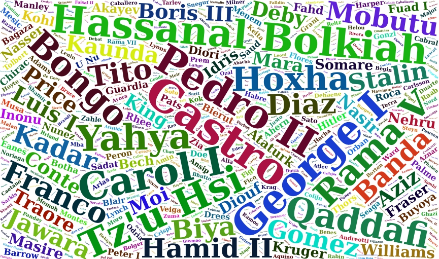

```{r, include = F}
# This is the recommended set up for flipbooks
# you might think about setting cache to TRUE as you gain practice --- building flipbooks from scratch can be time consuming
knitr::opts_chunk$set(fig.width = 6, message = FALSE, warning = FALSE, comment = "", cache = F, dev = "svg", fig.ext = "svg", fig.retina=2)
library(flipbookr)
library(tidyverse)
library(ggmap)
library(ggrepel)
library(haven)
library(tidyverse)
library(osmdata)
library(sf)
library(ggmap)
library(emojifont)
library(kableExtra)
library(OpenStreetMap)
```

```{r xaringan-themer, include=FALSE, warning=FALSE}
library(xaringan)
library(xaringanthemer)
style_mono_accent(base_color = "#43418A", text_font_google   = google_font("Fira Sans", "300", "300i"))
```


# A Grammar of Graphics

--
- data

--
- a mapping from data to aesthetics

--
- a geometry for representing the aesthetic


---

# My Primitive: A canvas

--
### Data as coordinates in 1 or 2-d with aesthetics and geometries

--
Graphics are generically flat; they are (at most) **two dimensional**.

That is caused by the screen.

--

*Our visuals must respect these limitations but we can add colors, shapes, and sizes,*
--
 or even emojis.  `r emo::ji("fire")`


---
class:inverse, center, middle, bounceIn, bounceOut

# The canvas: Every graphic fits here

```{r, echo=FALSE, fig.height = 5, fig.width = 7, fig.align = "center", dev="svg"}
plot(x=rnorm(100),y=rnorm(100), pch="", bty="n", xlab="x", ylab="y", xlim=c(-2,2), ylim=c(-2,2), axes=FALSE)
```


---
class: tada
# One Important Caveat

There is one notable and widely seen exception to this charaterization.  
Size is total tenure.<sup>1<sup>

```{r, eval=FALSE, echo=FALSE}
# wordcloud code; not run
Archigos <- Archigos %>% mutate(tenure = startdate %--% enddate)
Archigos <- Archigos %>% mutate(tenureY = year(enddate) - year(startdate))
WCdata <- Archigos %>% group_by(leader) %>% summarise(TenC = sum(tenureY)) %>% arrange(desc(TenC)
WCdata %>% mutate(word=leader, freq=TenC) %>% wordcloud2(data=., color="random-dark", rotateRatio = 1, size=0.4)
```

.footnote[

[1] The install script for the packages used is in the talk directory as `source(url("http://rww.science/talk/ggsc/PackagesUsed.R"))`.  The interested reader can issue `source(url("https://rww.science/talk/ggsc/XSCSetup.R"))`.

]

---
class: heartBeat

## The Illustration

What determines x and y?    **Nothing.**    
Coordinates are arbitrary.




---
class: center, middle

# A Simple Example to Cement our Thinking

--

[Where am I?](https://where-am-i.net)


---
# I am in Oregon
## Let's Start There

Get the map of Oregon and then use `ggmap` to map it.

```{r, warning=FALSE, message=FALSE, eval=TRUE}
OR_map <- get_map(getbb("Oregon"))
# ggmap(OR_map) 
```


---
class: inverse, wobble

## The Result

```{r, fig.height=5, fig.width=8, echo=FALSE, results='hide', warning=FALSE, message=FALSE}
ggmap(OR_map)
```


---
class: inverse

# Me as Data

For now, just my GPS coordinates.

```{r}
Me <- data.frame(lat=45.5115834, lon=-122.6783126)
```


---
# Mapping Me...

- Put my data on the earlier map.  
- My data is a set of coordinates that are already defined on the map.  
- Let's locate me on the map.

```{r, eval=FALSE}
Me <- data.frame(lat=44.924943, lon=-123.043461)
ggmap(OR_map) +
ggimage::geom_emoji(data=Me, aes(y=lat, x=lon), image="1f4aa", size=0.125) + theme_nothing()
```

---
class: inverse
# Me on the Map

```{r, echo=FALSE, fig.width=8, fig.height=5}
ggmap(OR_map) + ggimage::geom_emoji(data=Me, aes(y=lat, x=lon), image="1f4aa", size=0.1) + theme_nothing()
```

I stand out.  It must have worked.

---
# Bonds

A dataset for illustrating the various available visualizations needs a certain degree of richness with manageable size.  The dataset on *Bonds* contains three categorical and a few quantitative indicators sufficient to show what we might wish.

---

## Loading the Data

```{r}
library(tidyverse)
library(skimr)
Bonds <- read.csv(url("https://raw.githubusercontent.com/robertwwalker/DADMStuff/master/BondFunds.csv"))
```

Bonds:
1. Type: **Intermediate Government** or **Short-Term Corporate**
2. Fees: **Yes** or **No**
3. Risk:  **Above Average**, **Average**, or **Below Average**
4. Assets: Assets under management (in $ Millions).
5. Return 2009: The annual returns in 2009.
6. 3-Year-Return: The average annual return over three years.
7. 5-Year-Return: The average annual return over five years.

---
## A Summary

```{r SummaryT2, echo=FALSE}
Bonds %>% 
  skim_without_charts() %>% 
  kableExtra::kable() %>% 
  kableExtra::scroll_box(height="300px", width="800px")
```

```{r SummaryT, eval=FALSE}
Bonds %>% 
  skim_without_charts()
```

Most data types are represented.  There is no time variable so dates and the visualizations that go with time series are omitted.  `kableExtra` is necessary to render my tables.  You can ignore that.

---

## A Quick Pivot Table

```{r, eval=FALSE}
library(kableExtra)
Bonds %>% 
  group_by(Risk) %>% 
  skim()
```

---

```{r, results='asis', echo=FALSE}
library(kableExtra)
Bonds %>% group_by(Risk) %>% skim() %>% kableExtra::kable(format = "html") %>%
    kable_styling() %>%
    scroll_box(width = "800px", height = "550px")
```


---

# Playing Along

A basic graphing template is handy to work from.  [You can access it here.](https://github.com/robertwwalker/DADMStuff/raw/master/GraphingTemplate.Rmd)


---

# One Qualitative Variable

---

## Bar plots and column plots

There are two ways to construct a barplot; we can let ggplot handle it on the raw data or calculate it ourselves.  Let me focus on *Risk*.

---
### Raw Data Bar Plot


```{r}
Bonds %>%  ggplot() + aes(x=Risk) + 
  geom_bar()
```

---
### Raw Data Bar Plot


```{r Bas1, include=FALSE}
Bonds %>% 
  ggplot() + 
  aes(x=Risk) + 
  geom_bar()
```


`r chunk_reveal("Bas1")`


---

```{r QQ31, include=FALSE}
Bonds %>% 
  ggplot() + 
  aes(x=Risk, color=Risk) + 
  geom_bar()
```

---

`r chunk_reveal("QQ31")`


---

### Raw Data Bar Plot [Color]

We could color it.

```{r QQ33, include=FALSE}
Bonds %>% 
  ggplot() + 
  aes(x=Risk, color=Risk) + 
  geom_bar(fill="white") + 
  guides(color=FALSE)
```

---

`r chunk_reveal("QQ33")`

---

### Raw Data Bar Plot [Fill]

We can fill the shapes.

```{r QQ45, include=FALSE}
Bonds %>% 
  ggplot(., aes(x=Risk, fill=Risk)) + 
  geom_bar() + 
  guides(fill=FALSE)
```

---

`r chunk_reveal("QQ45")`

---

## `geom_bar()` meets `fill`

We can also deploy `fill` but x is no longer the axis; the axis is some constant value with frequencies filled by the fill.  *This will require some prettying.*

### A Cumulative Bar Plot

```{r QQ55, include=FALSE}
Basic.Bar <- Bonds %>% 
  ggplot(., aes(x="", fill=Risk)) +
  geom_bar()
Basic.Bar
```

The prettying will require that I eliminate the x axis [set it to empty], include a theme, and give it proper labels.

---

`r chunk_reveal("QQ55")`


---

### Enhanced Cumulative Bar Plot

```{r QQ65, include=FALSE}
Bonds %>% ggplot(., aes(x="", fill=Risk)) +
  geom_bar() + 
  labs(x="", y="Number of Funds") +
  theme_minimal() + 
  theme(axis.text.x= element_blank())
```

---

`r chunk_reveal("QQ65")`

---

### Proportion Bar Plot

```{r QQ75, include=FALSE}
Bonds %>% 
  ggplot(., aes(x="", fill=Risk)) +
  geom_bar(position="fill") +
  labs(x="", y="Proportion of Funds")
```

The prettying will require that I eliminate the x axis [set it to empty], include a theme, and give it proper labels.

---

`r chunk_reveal("QQ75")`


---

### Enhanced Proportion Bar Plot

```{r QQ77, include=FALSE}
Bonds %>% ggplot(., aes(x="", fill=Risk)) +
  geom_bar(position="fill") + 
  labs(x="", y="Propotion of Funds") +
  theme_minimal()
```

`r chunk_reveal("QQ77")`

---

## geom_col()

```{r QQ78, include=FALSE}
Risk.Table <- table(Bonds$Risk) %>% data.frame()
Risk.Table %>% 
  ggplot(., aes(x=Var1, y=Freq)) + 
  geom_col()
```

`r chunk_reveal("QQ78")`


---

### Beautifying `geom_col()`

Now it really needs some beautification.

```{r QQ88, include=FALSE}
Risk.Table %>% 
  ggplot(., aes(x=Var1, y=Freq, fill=Var1)) + 
  geom_col() + 
  labs(x="Risk Levels", y="Number of Funds") + 
  theme_minimal() + 
  theme(axis.text.x= element_blank()) + 
  scale_fill_viridis_d() + 
  guides(fill=FALSE)
```

---

`r chunk_reveal("QQ88")`

---

## `position = "fill"`

The two commands are symmetric in the sense that x as axis always splits it into multiple parts.  `fill` will prove very useful with a two dimensional table.

```{r QQ89, include=FALSE}
Risk.Table %>% 
  ggplot(., aes(x=1, y=Freq, fill=Var1)) +
  geom_col(position = "fill") + 
  labs(x="Risk Levels", y="Number of Funds") +
  theme_minimal() + 
  theme(axis.text.x= element_blank()) +
  scale_fill_viridis_d() + 
  guides(fill=FALSE)
```

`r chunk_reveal("QQ89")`


---

## A lollipop chart

A lollipop chart is a combination of two geometries.  It is a basic scatterplot combining one qualitative variable and the quantitative count of the number of observations.  The head of the lollipop is a point while there is an accompanying line segment from (x,0) to (x,Freq) where Freq is the default name for a count from a table.

---

### Basic Lollipop Chart

```{r QQ94, include=FALSE}
Risk.Table %>% 
  ggplot(., aes(x=Var1, y=Freq, color=Var1)) + 
  geom_point(size=6) + 
  labs(x="Risk Level", y="Number of Funds", color="Risk Level")+ 
  geom_segment(aes(xend=Var1, y=0, yend=Freq)) +
  theme_minimal()
```

`r chunk_reveal("QQ94")`

---

### Slicked Lollipop Chart by Adjusting Segment Size

```{r QQ95, include=FALSE}
Risk.Table %>% 
  ggplot(., aes(x=Var1, y=Freq, color=Var1)) + 
  geom_point(size=6) + 
  labs(x="Risk Levels", y="Number of Funds")+ 
  geom_segment(aes(xend=Var1, y=0, yend=Freq), size=1.5) +
  theme_minimal()  + 
  guides(color=FALSE)
```

`r chunk_reveal("QQ95")`


---

```{r QQ96, include=FALSE}
Risk.Table %>% 
  ggplot(., aes(x=Var1, y=Freq, color=Var1)) + 
  geom_point(size=6) + 
  labs(x="Risk Levels", y="Number of Funds")+ 
  geom_segment(aes(xend=Var1, y=0, yend=Freq)) + 
  theme_minimal()  + 
  scale_color_viridis_d() + 
  guides(color=FALSE) + 
  coord_flip()
```

`r chunk_reveal("QQ96")`


---

### A Lollipop Table [geom_label()]

Now I will switch up the points to be the actual values as text.  For this, I use the `geom_text` aesthetic that requires a `label` to be assigned.  I also want to put down the lines before the text to avoid overlap.

```{r}
Risk.Table %>% 
  ggplot(., aes(x=Var1, y=Freq, color=Var1, label=Freq)) +
  labs(x="Risk Levels", y="Number of Funds")+ 
  geom_segment(aes(xend=Var1, y=0, yend=Freq)) + 
  geom_label(size=6) + 
  theme_minimal()  + 
  scale_color_viridis_d() + 
  guides(color=FALSE) + 
  coord_flip()
```

---

### A Lollipop Table [geom_text() inverse]

The ggplot is built in layers so the segment before the label makes sure that the white shows up.  The fill and a discrete color are combined to create this graphical table.

---

```{r QQ98, include=FALSE}
Risk.Table %>% 
  ggplot(., aes(x=Var1, y=Freq, color=Var1, fill=Var1, label=Freq)) +
  geom_segment(aes(xend=Var1, y=0, yend=Freq), size=1.5) +
  geom_label(size=6, color="white") + 
  labs(x="Risk Levels", y="Number of Funds")+ 
  theme_minimal()  + 
  scale_color_viridis_d() + 
  scale_fill_viridis_d() + 
  guides(fill=FALSE, color=FALSE) + 
  coord_flip()
```

`r chunk_reveal("QQ98")`


---

## I HATE PIE CHARTS

A pie chart is fairly easy to do.  Let's go back and show something that I find pretty amazing.  A pie chart is a bar chart [the fill variety] with coordinates that fill a circle rather than a square.  We take the most basic bar plot -- Basic.Bar -- and add three things: new coordinates that are polar, labels, and a blank theme to eliminate axis labels.

---

```{r QQ99, include=FALSE}
Basic.Bar + 
  coord_polar("y", start=0) + 
  labs(x="", y="") + 
  theme_void()
```

`r chunk_reveal("QQ99")`


---

# One Quantitative Variable

---
## `geom_histogram()`

```{r FB1, include=FALSE}
Bonds %>% 
  ggplot() + 
  aes(x=Assets) + 
  geom_histogram()
```

`r chunk_reveal("FB1")`

---
### Histograms [bins]

We can choose more bins. 50?  That is far more than the default of 30.

```{r BF2, include=FALSE}
Bonds %>% 
  ggplot() + 
  aes(x=Assets) + 
  geom_histogram(bins=50)
```

`r chunk_reveal("BF2")`

---

We can also choose fewer bins.  I will choose 10.

```{r BF3, include=FALSE}
Bonds %>% 
  ggplot() + 
  aes(x=Assets) + 
  geom_histogram(bins=10)
```


`r chunk_reveal("BF3")`

---

## Histograms [binwidth]

We can also set the width of bins in the metric of `x`; I will choose 500 (bigger).

```{r BF4, include=FALSE}
Bonds %>% 
  ggplot() + 
  aes(x=Assets) + 
  geom_histogram(binwidth=500)
```

`r chunk_reveal("BF4")`

---

We can also set the width of bins in the metric of `x`; I will choose 50 (smaller width makes more bins).

```{r BF5, include=FALSE}
Bonds %>% 
  ggplot() + 
  aes(x=Assets) + 
  geom_histogram(binwidth=50)
```

`r chunk_reveal("BF5")`

---

## `geom_dotplot()`

`geom_dotplot()` places a dot for every observation in the relevant bin.  We can control the size of the bins [in the original metric] with `binwidth=`.

### Small binwidth

```{r BF6, include=FALSE}
Bonds %>% 
    ggplot() + 
    aes(x=Assets) + 
    geom_dotplot(binwidth=10)
```

`r chunk_reveal("BF6")`

---

### Large binwidth

```{r BF7, include=FALSE}
Bonds %>% 
    ggplot() + 
    aes(x=Assets) + 
    geom_dotplot(binwidth=1000)
```

`r chunk_reveal("BF7")`

---

### An ?optimal? binwidth

Each dot represents a datum with bins of size 100.

```{r BF8, include=FALSE}
Bonds %>% 
    ggplot() + 
    aes(x=Assets) + 
    geom_dotplot(binwidth=100) + labs(y="")
```


`r chunk_reveal("BF8")`

---
## `geom_freqpoly()`

`geom_freqpoly()` is the line equivalent of a histogram.  The arguments are similar, the output doesn't include the bars as it does in the histogram.

```{r BF9, include=FALSE}
Bonds %>% 
  ggplot(., aes(x=Assets)) +
  geom_freqpoly()
```

`r chunk_reveal("BF9")`

---

### More bins

```{r BF10, include=FALSE}
Bonds %>% 
  ggplot(., aes(x=Assets)) +
  geom_freqpoly(bins=50)
```

`r chunk_reveal("BF10")`

---

### Fewer bins

```{r BF11, include=FALSE}
Bonds %>% 
  ggplot(., aes(x=Assets)) +
  geom_freqpoly(bins=10)
```

`r chunk_reveal("BF11")`

---
## `geom_area()`

Is a relative of the histogram with lines connecting the midpoints of the bins and an associated fill from zero.  It defaults to 30 bins.

```{r BF12, include=FALSE}
Bonds %>% 
  ggplot(., aes(x=Assets)) + 
  geom_area(stat="bin")
```

`r chunk_reveal("BF12")`

---
### Large binwidth with a small number of bins

```{r BF13, include=FALSE}
Bonds %>% 
   ggplot(., aes(x=Assets)) + 
   geom_area(stat="bin", bins=10) + theme_minimal()
```

`r chunk_reveal("BF13")`


---
### Small binwidth with a large number of bins

I will color in the area with magenta and clean up the theme.

```{r BF14, include=FALSE}
Bonds %>% 
   ggplot(., aes(x=Assets)) + 
   geom_area(stat="bin", bins=100, fill="magenta") + theme_minimal()
```

`r chunk_reveal("BF14")`

---

## `geom_density()`

A relative of the histogram and the area plots above, the density plot smooths out the blocks of a histogram with a moving window [known as the bandwidth].

---

### `geom_density()` outlines

```{r BF15, include=FALSE}
Bonds %>% 
   ggplot(., aes(x=Assets)) + 
   geom_density(outline.type = "upper")
```

`r chunk_reveal("BF15")`

---

```{r BF16, eval=FALSE}
Bonds %>% 
   ggplot(., aes(x=Assets)) + 
   geom_density(outline.type = "lower")
```

`r chunk_reveal("BF16")`

---

```{r BF17, eval=FALSE}
Bonds %>% 
   ggplot(., aes(x=Assets)) + 
   geom_density(outline.type = "full")
```

`r chunk_reveal("BF17")`


---

### `geom_density()` adjust

Adjust applies a numeric correction to the bandwidth.  Numbers greater than 1 make the bandwidth bigger [and the graphic smoother] and numbers less than 1 [but greater than zero] make the bandwidth smaller and the graphic more jagged.


```{r BF18, include=FALSE}
Bonds %>% 
  ggplot(., aes(x=Assets)) +
  geom_density(adjust=2)
```

`r chunk_reveal("BF18")`

---

```{r BF19, include=FALSE}
Bonds %>% 
  ggplot(., aes(x=Assets)) +
  geom_density(adjust=1/2)
```

`r chunk_reveal("BF19")`

---

## `geom_boxplot`

A boxplot shows a box of the first and third quartiles and a notch at the median.  The dots above or below denote points outside the hinges.  The hinges [default to 1.5*IQR] show a range of expected data while the individual dots show possible outliers outside the hinges.  To adjust the hinges, the argument `coef=1.5` can be adjusted.

```{r BF20, include=FALSE}
Bonds %>% ggplot(., aes(x=Assets)) +
  geom_boxplot()
```

`r chunk_reveal("BF20")`

---

## `geom_qq()`

To compare empirical and theoretical quantiles.  Comparing a distribution to the normal or others is common and this provides the tool for doing so.  The default is a normal.

The empirical cumulative distribution function arises when we sort a quantitative variable and show the percentiles below said value.

```{r BF21, include=FALSE}
Bonds %>% 
  ggplot(aes(sample=Assets)) +
  geom_qq()
```

---

## `stat_ecdf(geom = )`

We could do this with most geometries.  I will show a few.

---

### `stat_ecdf(geom = "step")`

```{r BF22, include=FALSE}
Bonds %>%  
  ggplot(aes(x=Assets)) + 
  stat_ecdf(geom = "step") + 
  labs(y="ECDF: Proportion less than Assets") + 
  theme_minimal()
```

`r chunk_reveal("BF22")`

---

### `stat_ecdf(geom = "point")`

```{r BF23, include=FALSE}
Bonds %>%  
  ggplot(aes(x=Assets)) + 
  stat_ecdf(geom = "point") + 
  labs(y="ECDF: Proportion less than Assets") + 
  theme_minimal()
```

`r chunk_reveal("BF23")`

---
### Combining two

```{r BF24, include=FALSE}
Bonds %>%  
  ggplot(aes(x=Assets)) + 
  stat_ecdf(geom = "point") + 
  stat_ecdf(geom = "step", alpha=0.1) + 
  labs(y="ECDF: Proportion less than Assets") + 
  theme_minimal()
```

`r chunk_reveal("BF24")`

---
### `stat_ecdf(geom = "line")`

```{r BF25, include=FALSE}
Bonds %>%  
  ggplot(aes(x=Assets)) + 
  stat_ecdf(geom = "line") + 
  labs(y="ECDF: Proportion less than Assets") + 
  theme_minimal()
```

`r chunk_reveal("BF25")`


---
### `stat_ecdf(geom = "area")`

```{r BF26, include=FALSE}
Bonds %>%  
  ggplot(aes(x=Assets)) + 
  stat_ecdf(geom = "area", alpha=0.2) + 
  labs(y="ECDF: Proportion less than Assets") + 
  theme_minimal()
```

`r chunk_reveal("BF26")`

---

# Mixed Variables

---

## `geom_boxplot()`

This will construct a boxplot of quantitative y for each value of the qualitative variable placed on x.  This is very hard to read because of the extrema.

```{r MF72, include=FALSE}
Bonds %>% 
  ggplot(., aes(x=Risk, y=Assets)) + 
  geom_boxplot()
```

`r chunk_reveal("MF73")`

---

## `geom_dotplot()`

The number of bins, the axis they are placed on, and the size of the dots are core to dotplots.  It is often simply a matter of trial and error.

```{r MF73, include=FALSE}
Bonds %>% 
  ggplot(., aes(x=Risk, y=Assets, color=Risk)) + 
  geom_dotplot(binaxis="y", bins=50, dotsize=0.3)
```

`r chunk_reveal("MF73")`

---

### Improved

```{r MF74, include=FALSE}
Bonds %>% 
  ggplot(., aes(x=Risk, y=Assets, color=Risk)) + 
  geom_dotplot(binaxis="y", bins=50, dotsize=0.3) + guides(color=FALSE) + theme_minimal()
```

`r chunk_reveal("MF74")`


---

## `geom_violin()`

The most basic violin plot shows a two-sided density plot for each value of x.  By default, all violins have the same area.

```{r MF75, include=FALSE}
Bonds %>% 
  ggplot(., aes(x=Risk, y=Assets)) + 
  geom_violin()
```

`r chunk_reveal("MF75")`

---
### Adjusting the area: `scale=count`

We can adjust the violins to have area proportional to the count of observations by deploying the scale argument set equal to count.

```{r MF76, include=FALSE}
BSC <- Bonds %>% 
  ggplot(., aes(x=Risk, y=Assets)) + 
  geom_violin(scale="count")
BSC
```

`r chunk_reveal("MF76")`

---

### Adjusting the area: `scale=width`

We can also adjust the violins to have equal width.

```{r MF77, include=FALSE}
Bonds %>% 
  ggplot(., aes(x=Risk, y=Assets)) + 
  geom_violin(scale="width")
```

`r chunk_reveal("MF77")`


---

### Adjusting the bandwidth

We can also make the violins smoother or more rigid with the `adjust=` argument.  Numbers greater than one make it smoother.

```{r MF78, include=FALSE}
Bonds %>% 
  ggplot(., aes(x=Risk, y=Assets)) + 
  geom_violin(scale="count", adjust=2)
```

Numbers less than one make it less smooth.

`r chunk_reveal("MF78")`

---

```{r MF79, include=FALSE}
Bonds %>% 
  ggplot(., aes(x=Risk, y=Assets)) + 
  geom_violin(scale="count", adjust=1/2)
```

`r chunk_reveal("MF79")`


---

## `geom_density()` with color/fill

We can color the lines of a density plot to try and showcase the various distributions.

```{r MF87, include=FALSE}
Bonds %>% 
  ggplot(., aes(x=Assets, color=Risk)) + 
  geom_density()
```
We fill the shape of density plot to try and showcase the various distributions.

`r chunk_reveal("MF87")`

---

```{r MF88, include=FALSE}
Bonds %>% 
  ggplot(., aes(x=Assets, fill=Risk)) + 
  geom_density()
```

This almost always needs lightening.

`r chunk_reveal("MF88")`

---

```{r MF89, include=FALSE}
Bonds %>% 
  ggplot(., aes(x=Assets, fill=Risk)) + 
  geom_density(alpha=0.2)
```

In this case, it helps to remove the outline.

`r chunk_reveal("MF89")`

---

```{r MF90, include=FALSE}
Bonds %>% 
    ggplot(., aes(x=Assets, fill=Risk)) + 
    geom_density(alpha=0.2, color=NA)
```

`r chunk_reveal("MF90")`

---

## `geom_beeswarm()`

Related to the dotplot is the beeswarm.  It requires installing a package with the geometry known as ggbeeswarm.

```
install.packages("ggbeeswarm")
```
---

```{r MF94, include=FALSE}
library(ggbeeswarm)
Bonds %>% ggplot() + 
  aes(x=Risk, y=Assets) + 
  geom_beeswarm()
```

`r chunk_reveal("MF94")`

---

```{r MF95, include=FALSE}
Bonds %>% 
  ggplot() + 
  aes(x=Risk, y=Assets, color=Risk) + 
  geom_beeswarm() + 
  guides(color=FALSE)
```

`r chunk_reveal("MF95")`

---

## `ggridges`

```
install.packages("ggridges")
```

A ridgeline plot represents a categorical variable (y) with stacked density plots of (x).  We will make use of the most basic one first.

```{r MF97, include=FALSE}
library(ggridges)
Bonds %>% ggplot(aes(x=Assets, y=Risk, group=Risk)) + 
  geom_density_ridges() + 
  theme_ridges()
```

I do not like the overlap in the lines.  This can be controlled with a scaling factors `scale=1` that forces no overlap.

---

`r chunk_reveal("MF97")`

---

### `scale=1`

```{r MF98, include=FALSE}
Bonds %>% 
  ggplot(aes(x=Assets, y=Risk, group=Risk)) + 
  geom_density_ridges(scale=1) + 
  theme_ridges()
```

---

`r chunk_reveal("MF98")`

---

### Something prettier

```{r DNT11, include=FALSE}
Bonds %>% ggplot(aes(x=Assets, y=Risk, group=Risk, color=Risk, fill=Risk)) +  
  geom_density_ridges(scale = 1, alpha=0.2)  + 
  guides(color=FALSE, fill=FALSE) + 
  theme_ridges()
```

---

`r chunk_reveal("DNT11")`

---
class: inverse

# Two Qualitative Variables


---
## Building a Table

```{r}
BTDF <- Bonds %>% group_by(Risk,Fees) %>% summarise(Count = n()) %>% data.frame()
BTDF %>% pivot_wider(names_from=Fees, values_from=Count)
```

---
# A Tidy Table

The table as a data.frame.

```{r}
BTDF
```

---

## `geom_tile`

```{r Q287, include=FALSE}
BTDF %>% 
  ggplot(., aes(x=Risk, y=Fees, fill=Count)) + 
  geom_tile() +
  scale_fill_viridis_c() + 
  theme_minimal() + labs(fill="Number of Funds")
```

`r chunk_reveal("Q287")`

---

## `geom_label` a visual table

```{r Q288, include=FALSE}
BTDF %>% 
  ggplot(., aes(x=Risk, y=Fees, label=Count)) + geom_label() + theme_minimal() + labs(subtitle="Counts of Funds Shown")
```

`r chunk_reveal("Q288")`

---

### A Tile Table

```{r Q289, include=FALSE}
BTDF %>% 
  ggplot(., aes(x=Risk, y=Fees, label=Count, fill=Count)) +   
  geom_tile(alpha=0.2) +
  scale_fill_viridis_c() + 
  geom_text() + 
  theme_minimal() + 
  labs(subtitle="Counts of Funds Shown")
```

`r chunk_reveal("Q289")`

---

## Raw Data Plots

---

## `geom_count()`

```{r Q296, include=FALSE}
Bonds %>% ggplot() + 
  aes(x=Risk, y=Fees) + 
  geom_count() + 
  theme_minimal()
```

`r chunk_reveal("Q296")`


---

# `geom_bar(fill=)`

Now let us look at the bar plot.  First, start with Risk.

---

```{r Q297, include=FALSE}
Bonds %>% 
  ggplot() + 
  aes(x=Risk) + 
  geom_bar()
```

`r chunk_reveal("Q297")`

---

To add Fees to the plot, we can fill the bars.

```{r Q298, include=FALSE}
Bonds %>% 
  ggplot() + 
  aes(x=Risk, fill=Fees) + 
  geom_bar()
```

`r chunk_reveal("Q298")`

---

## Conditional Probability: `(position="fill")`

We can also plot this normalized by the number in each category of x so that the plots represent conditional probability.

```{r Q299, include=FALSE}
Bonds %>% 
  ggplot() + 
  aes(x=Risk, fill=Fees) + 
  geom_bar(position="fill")
```

`r chunk_reveal("Q299")`

```{css, eval = TRUE, echo = FALSE}
.remark-code{line-height: 1.5; font-size: 80%}

@media print {
  .has-continuation {
    display: block;
  }
}
```
