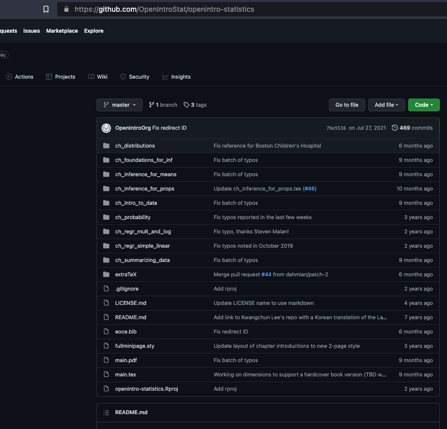
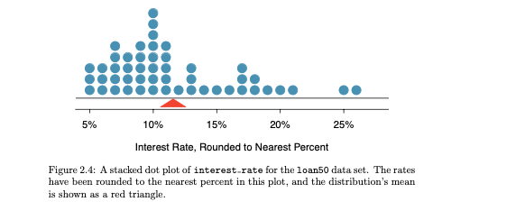

class: center

```{r setup, include=FALSE}
options(htmltools.dir.version = FALSE, knitr.table.format = "html")
knitr::opts_chunk$set(warning=FALSE, message=FALSE, fig.showtext = TRUE, fig.height=6, fig.retina=3, dev="CairoJPEG")
library(tidyverse)
library(xaringan)
library(magrittr)
library(DT)
library(flipbookr)
```

```{r xaringan-themer, eval=TRUE, include=FALSE, warning=FALSE}
library(xaringanthemer)
extra_css <- list(
  ".small" = list("font-size" = "90%"),
  ".scroll-output" = list("font-size" = "90%", "height" = "75%", "overflow-y" = "scroll")
  )
style_mono_light(base_color = "#7d07f8",
          text_font_google   = google_font("EB Garamond"), 
          code_font_google   = google_font("Fira Mono"),
          extra_css = extra_css)
```


<iframe src="https://prezi.com/p/embed/E72vUeF6v22VkSrCfYpd/" id="iframe_container" frameborder="0" webkitallowfullscreen="" mozallowfullscreen="" allowfullscreen="" allow="autoplay; fullscreen" height="600" width="800"></iframe>


---
# A syllabus

[Let's walk through that.](https://wise.willamette.edu/access/content/group/GSMPR-622-P2-23_FA/Syllabus/Syllabus-SP23-P2-622.pdf)

---
# First Day Work

## Some Quick R and Excel Tools

---
class: right
background-image: url("images/RMD.png")
background-size: contain

# Some Comments on Workflow

Everything is built around R and RStudio.

--

RMarkdown is my tool of choice.  

--

In fact, these slides are RMarkdown rendered as .html.  

--

The *RStudio* has a *knit* button that renders the document so long as it contains the appropriate packages.

--

It is literate programming; it allows us to combine results and output.  

--

In a host of different formats.  

--

That are fundamentally reproducible: *the key to science*.

---

# Some Example Data

The data are Bond.Funds.  We have an ID, Type, Assets, Fees [Yes or No], Expense Ratio, Returns in 2009, 3 year, 5 year, and a Risk classification.  A [link to the data](https://github.com/robertwwalker/DADMStuff/raw/master/BondFunds.csv).

```{r, eval=FALSE, tidy=TRUE}
load(url("https://github.com/robertwwalker/DADMStuff/raw/master/R-Workspace-Lecture-1.RData"))
Bonds
# read from Excel:
# Bonds <- readxl::read_xls("/home/rob/Downloads/BondFundsSupport.xls", sheet="JustData")
```

---

```{r, echo=FALSE}
load(url("https://github.com/robertwwalker/DADMStuff/raw/master/R-Workspace-Lecture-1.RData"))
Bonds %>% datatable(class = "compact", 
                    rownames = FALSE, 
                    extensions = "Buttons",
                    options = list(dom = 'tBp', scrollY = TRUE, buttons = c("csv","excel"), pageLength = 8)) %>%
  DT::formatRound(1:4, digits = 1)
```

---
# My Current Thinking

An analogy: $R$ is like learning a foreign language.  It has the essential elements of   

- syntax 
- structure  
- scoping  

Learning how R thinks and communicates is crucial and that is largely an interaction between you and $R$.

** $R$ is a language for data. **


---
class: inverse

# Some Essential Excel

- Formulae  
- Absolute and relative references  
- Pivot tables   

It has some nice features.  

It fails the simple test of manipulability of the underlying data.

---


## Formulae

Pre-programmed functions that take input ranges of cells and produce particular outputs.

A [link to some data](https://github.com/robertwwalker/DADMStuff/raw/master/BondFunds.csv).

e.g. set cell `J5` to be:

```
=AVERAGE(C2:C21)
```

This averages the range between C2 and C21 [Assets].  When we copy this left or right, up or down, the numbers and/or letters adjust.  

**Let's try to make column L into `=C2 - J5` all the way down to C21.**  

NB: The average is technically known as the *arithmetic mean*; it is sometimes short-formed to the mean, though there are geometric and harmonic variants, also.

---

## Cell Referencing

We may not want that.  Suppose that I want to create a column showing the difference of assets and average assets.  In essence, we have *rescaled* assets such that 0 is the average and we are measuring above or below that average [and by how much].  The `$` holds an index constant [F4].  We have two.  In our case, we can hold both the rows and the column constant for the average.

--

Because we are only copying down, the `$5` would have sufficed.

```
=C2 - $J$5
=C2 - J$5
```

Then copy the formula down to L21.  Notice the C changes [no $] but the J doesn't. **The $ enables absolute cell referencing.** 

---

As expected.  Average assets over the first 20 is 1894.7; the first is 5373.4 above the average for this set.


---

## Formulae and Recursion

This can become quite involved; spreadsheets are programming tools.  **Their underlying problem is that they do not enforce rules or discipline along the way.**

The key to our formulae are one or more inputs, a series of transformation and operations, and one or more outputs defined in a precise fashion.  As an aside, the father of recursion as a core principle in computer science is teaching at Willamette this term -- Eric S. Roberts.  Functions link inputs and outputs. 

**They are models.**

---

# Pivot Tables

Are really cool; they are a very simple and quick way to slice and data and to gain useful comparative and/or summary insight.

They have the added virtue of being drag and drop.

All of the action comes in the calculations shown in the pivot table.  Unfortunately, it is extraordinarily limited.  

--

+ What if I want the median?  

--

+ How about the first and third quartiles?

---
# Cautionary Tale

[Excel has probably killed people...  recently](https://www.bbc.com/news/technology-54423988)

---

# R-escue

This will become easy with the group_by command in R's tidyverse.

```{r}
Bonds %>% group_by(Type) %>% summarise(Avg.Assets = mean(Assets, na.rm=TRUE),
                                       Avg.Returns = mean(`Return 2009`, na.rm=TRUE),
                                       `Assets 25th` = quantile(Assets, probs = c(0.25), na.rm = TRUE),
                                       `Assets 75th` = quantile(Assets, probs = c(0.75), na.rm = TRUE)) %>% kableExtra::kable()
```

---
## And it scales

```{r}
Bonds %>% group_by(Type,Risk) %>% summarise(Avg.Assets = mean(Assets, na.rm=TRUE),
                                       Avg.Returns = mean(`Return 2009`, na.rm=TRUE),
                                       `Assets 25th` = quantile(Assets, probs = c(0.25), na.rm = TRUE),
                                       `Assets 75th` = quantile(Assets, probs = c(0.75), na.rm = TRUE)) %>% kableExtra::kable()
```

---
## `skim()`

.scroll-output[
```{r, echo=FALSE}
# install.packages("skimr")
library(skimr)
Bonds %>% group_by(Type,Risk) %>% skim(Assets)
```
]

---

## First Graphs

```{r Fig1, eval=FALSE, message=FALSE, warning=FALSE, display_type="both", include=FALSE, results='hide'}
Bonds %>% ggplot(., aes(x=`Return 2009`, fill=Type)) + 
  geom_density(alpha = 0.3) + 
  scale_xaringan_fill_discrete() + 
  theme_xaringan() + 
  facet_wrap(vars(Risk)) + 
  labs(title="2009 Returns by Risk and Type", x="Returns in 2009")
```

`r chunk_reveal("Fig1", widths=c(30,70))`

---

```{r Fig1A, eval=TRUE, echo=FALSE, fig.width=12, fig.height=8, message=FALSE, warning=FALSE}
Bonds %>% ggplot(., aes(x=`Return 2009`, fill=Type)) + 
  geom_density(alpha = 0.3) + 
  scale_xaringan_fill_discrete() + 
  theme_xaringan() + 
  facet_wrap(vars(Risk)) + 
  labs(title="2009 Returns by Risk and Type", x="Returns in 2009")
```


---
# We Can Graph Exactly That

```{r Box1, eval=FALSE, message=FALSE, warning=FALSE, display_type="both", include=FALSE, results='hide'}
Bonds %>% ggplot(., aes(y=`Return 2009`, x=Type, color=Type)) + 
  geom_boxplot(alpha = 0.3) + 
  guides(color="none") + 
  scale_color_viridis_d() + 
  theme_xaringan() + 
  facet_wrap(vars(Risk)) + 
  labs(title="2009 Returns by Risk and Type", y="Returns in 2009") +   
  theme(axis.text.x = element_text(angle = 45, size=12))
```

`r chunk_reveal("Box1", widths=c(30,70))`

---

```{r Box1A, eval=TRUE, echo=FALSE, message=FALSE, warning=FALSE, fig.width=12, fig.height=8}
Bonds %>% ggplot(., aes(y=`Return 2009`, x=Type, color=Type)) + 
  geom_boxplot(alpha = 0.3) + 
  guides(color="none") + 
  scale_color_viridis_d() + 
  theme_xaringan() + 
  facet_wrap(vars(Risk)) + 
  labs(title="2009 Returns by Risk and Type", y="Returns in 2009") +   
  theme(axis.text.x = element_text(angle = 45, size=12))
```

---

```{r RTC, eval=FALSE, message=FALSE, warning=FALSE, display_type="both", include=FALSE, results='hide'}
Bonds %>% 
  group_by(Type,Risk) %>% 
  summarise(Count = n()) %>% 
  ggplot(., aes(x=Type, y=Risk, fill=Count)) + 
  geom_tile() + 
  labs(title="Funds by Risk and Type", y="Risk", x="Type")+ 
  scale_xaringan_fill_continuous() +
  theme_xaringan() + 
  theme(axis.text.x = element_text(angle = 45, size=12))
```

`r chunk_reveal("RTC", widths=c(30,70))`

---

```{r RTC1, eval=TRUE, echo=FALSE, message=FALSE, warning=FALSE, fig.width=12, fig.height=8}
Bonds %>% 
  group_by(Type,Risk) %>% 
  summarise(Count = n()) %>% 
  ggplot(., aes(x=Type, y=Risk, fill=Count)) + 
  geom_tile() + 
  labs(title="Funds by Risk and Type", y="Risk", x="Type")+ 
  scale_xaringan_fill_continuous() +
  theme_xaringan() 
```


---
# R Makes Data Understanding Easier


---
## Installing packages

R works by packages that add functionality.  The process is two parts: install a package [install.packages("package")] and then use it [library(package)].

R can handle installation for you.  In general, unless you know what it means, avoid compiling from source; binary packages are preferred.

```{r eval=FALSE, tidy=FALSE}
install.packages(c("tidyverse","skimr","magrittr","hrbrthemes","ggthemes"))
```

For your homework assignment, you will need

```{r eval=FALSE, tidy=FALSE}
install.packages(c("swirl"))
```

For a brief foray into R Graphics,

```{r eval=FALSE, tidy=FALSE}
install.packages(c("esquisse"))
```

--

The [RStudio IDE](https://www.rstudio.com/products/rstudio/), is highly recommended but you do not have to.  The command line or the base GUI work but you will have to type to render RMarkdown and I use it alot.

---
# Interacting with R is Crucial

**That's where swirl and learnr come in.**

```{r eval=FALSE, tidy=FALSE}
install.packages("swirl")
library(swirl)
install_course_github("swirldev", "R_Programming_E")
swirl()
```

This is set up to email completions.  Or you can screenshot them.  It helps you learn how $R$ thinks.  In the end, it is for your benefit.

---
# Takeaways

1. The biggest barrier to learning from data is not having a useful pipeline.  
--

2. Data should be tidy and easy to analyse.  We spend time analysing rather than cleaning.  
--

3. R makes getting data in and out easy.  It links with tons of things.  
--

4. R with Markdown make automated report writing and other literate uses of data, graphics, and text easy to do.  
--

5. The assignment for this week involves practicing this and getting acquainted with R via *swirl*.  
--

6. As a first task, we need to get data from Excel to R.  There is a worked example in `Resources > R Documents > Import Data from Excel into R` to work with.

---
# A Postscript

+ Interacting with the course text.  Note the tab on the left of the course website that links to the course text github.  It leads to this:



---
# Let's Recreate a Textbook Plot

Let's navigate to chapter 2: summarizing data.  Then Figures.  This is `loan_int_rate_dot_plot`.  The code is the .R file.



---
# Code for that

```{r, echo=TRUE, eval=FALSE}
library(openintro)
d <- loan50$interest_rate
xlim <- c(0.9 * min(d), 1.05 * max(d))
round.to <- 1
binned <- round.to * round(d / round.to)
tab <- table(binned)
M <- mean(d)
cex    <- 1
plot(0, type = "n", xlab = "Interest Rate, Rounded to Nearest Percent", ylab = "", axes = FALSE, xlim = xlim, ylim = c(-1, 1.5 * max(tab)))
for (i in 1:length(tab)) {
  points(rep(as.numeric(names(tab[i])), tab[i]),
         1.5 * (1:tab[i]) - 0.4,
         pch = 19,
         col = COL[1],
         cex = 2 * cex)
}
abline(h = 0)
AxisInPercent(1, pretty(c(0, d)))
polygon(M + c(-1, 1, 0) * 1, c(-1.2, -1.2, -0.1), border = COL[4], col = COL[4])
```

---
# It Is [Like Everything] Reproducible

```{r, echo=FALSE, eval=TRUE}
library(openintro)
d <- loan50$interest_rate
xlim <- c(0.9 * min(d), 1.05 * max(d))
round.to <- 1
binned <- round.to * round(d / round.to)
tab <- table(binned)
M <- mean(d)
cex    <- 1
plot(0, type = "n", xlab = "Interest Rate, Rounded to Nearest Percent", ylab = "", axes = FALSE, xlim = xlim, ylim = c(-1, 1.5 * max(tab)))
for (i in 1:length(tab)) {
  points(rep(as.numeric(names(tab[i])), tab[i]),
         1.5 * (1:tab[i]) - 0.4,
         pch = 19,
         col = COL[1],
         cex = 2 * cex)
}
abline(h = 0)
AxisInPercent(1, pretty(c(0, d)))
polygon(M + c(-1, 1, 0) * 1, c(-1.2, -1.2, -0.1), border = COL[4], col = COL[4])
```
